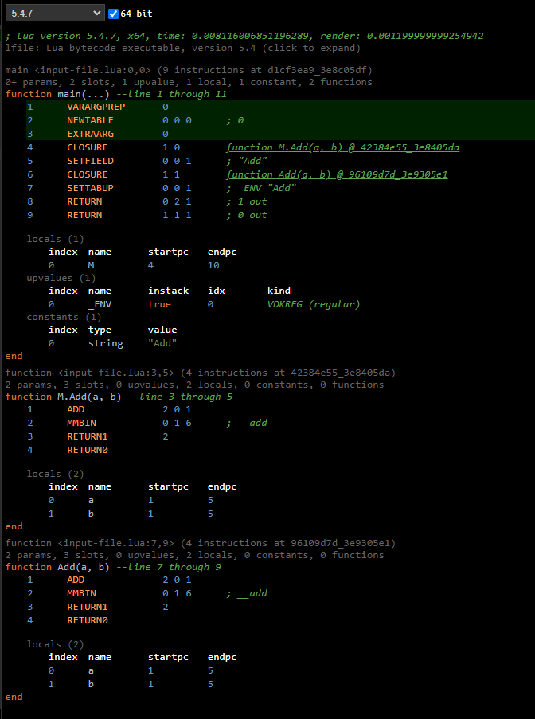
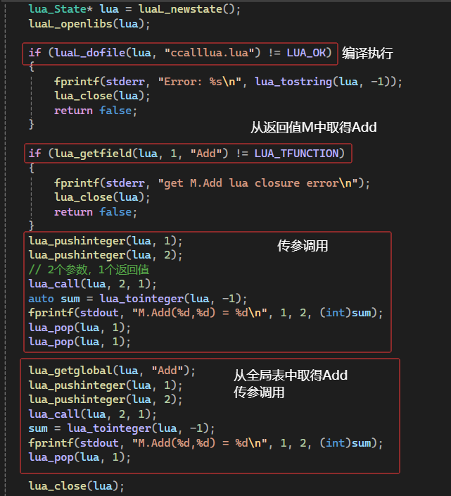

```lua
local M = {}

function M.Add(a, b)
    return a + b
end

function Add(a, b)
    return a + b
end

return M
```

1. 编译执行完成后，全局表中有_G["Add"] = LClosure
2. 编译执行完成后，栈顶是M表，M["Add"] = LClosure
3. 生成的指令


1. c/c++中调用
   
