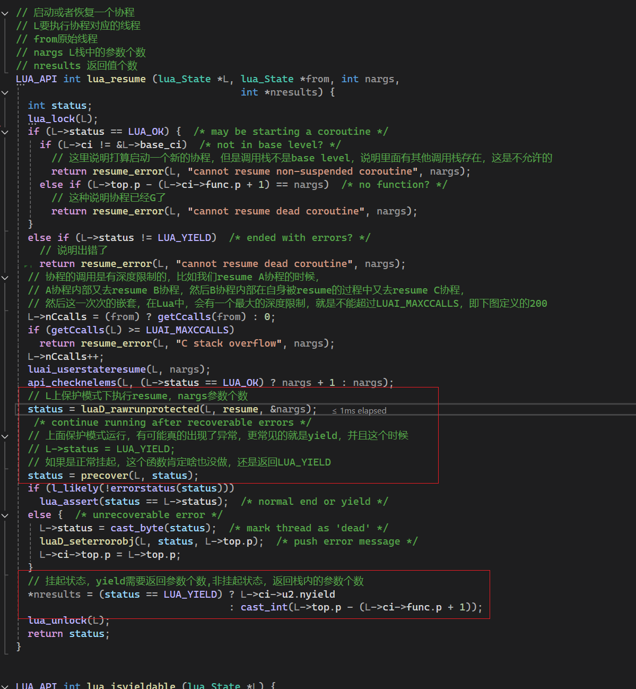
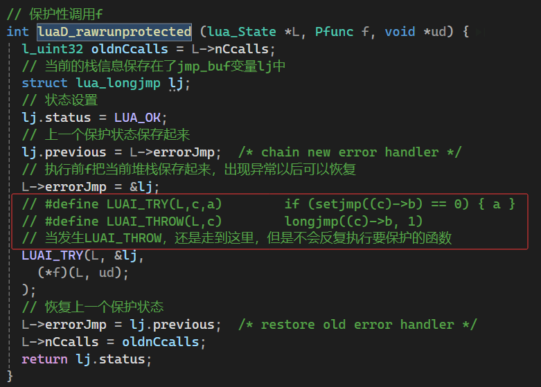
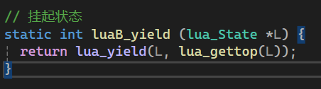
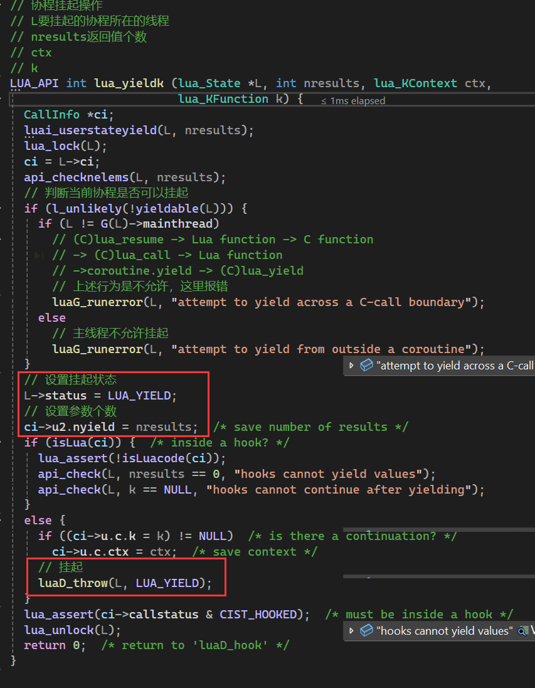
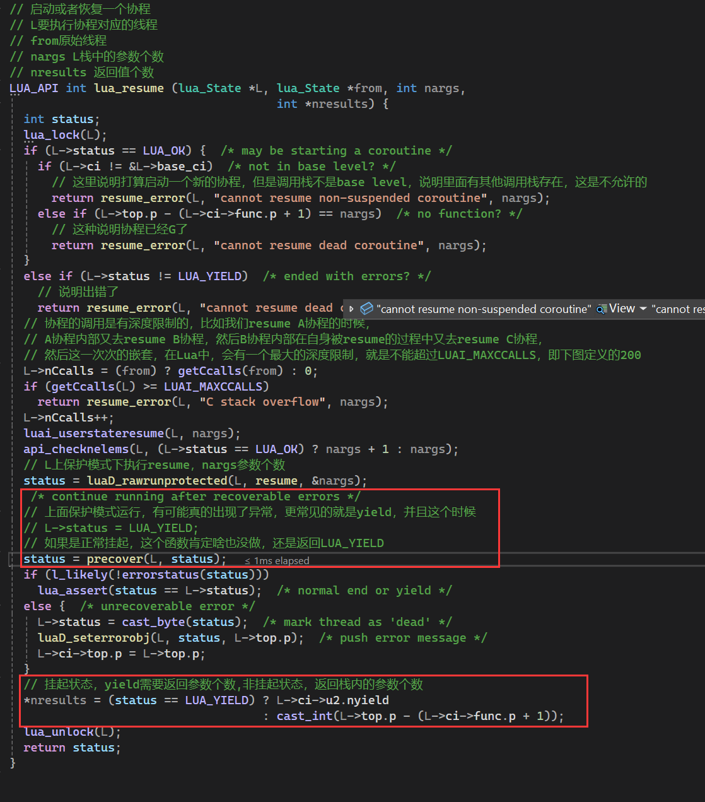
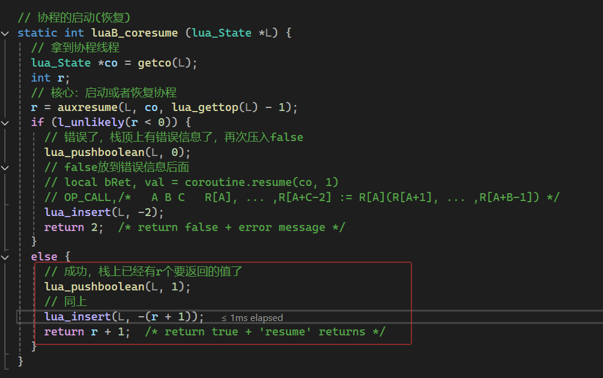
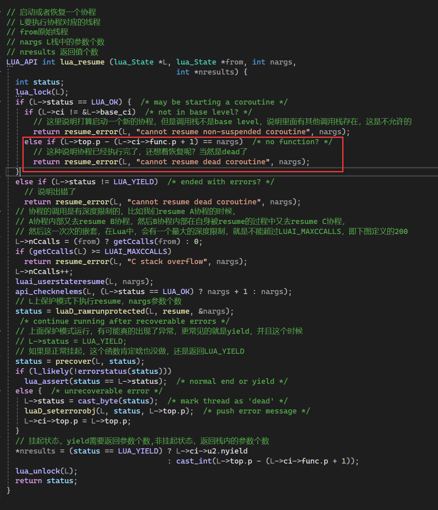

1. 协程的四种状态
```C
// 协程的状态
// 协程正在运行时
#define COS_RUN		0
// 协程运行完尝试运行 或者 在运行代码时发生了错误
#define COS_DEAD	1
// 协程刚被创建时 或者 遇到函数中的yield关键字时，它的状态变为suspended
#define COS_YIELD	2
// 协程处于正常状态，没有运行，协程A中唤醒协程B，A就处于正常状态，B就处于运行状态
#define COS_NORM	3

static const char *const statname[] =
  {"running", "dead", "suspended", "normal"};
```

2. coroutine.create, 创建一个协程，不运行，处于COS_YIELD/"suspended"
```lua
-- 创建协程，没有运行，co是NL
local co = coroutine.create(
    function(arg)
        print("start yield")
        local result = coroutine.yield(arg)
        print("restart co",  result)
        return result * arg
    end
)
```
```C
// 创建一个协程
/*
* 调用本函数结尾
* L:
* [
*   ...(上一个ci)
*   L->ci->func(coroutine.create), 
*   协程函数LClosure, 
*   NL， 
*   L->top(free位置)
* ]
* 
* NL: 
* [
*   NL->ci->func,
*   协程函数LClosure,
*   NL->top(free位置)
* ]
* 
* L调用完成后
* L:
* [
*   ...(上一个ci)
*   NL，
*   L->top(free位置)
* ]
*/
static int luaB_cocreate (lua_State *L) {
  lua_State *NL;
  // 确保当前栈第一个元素是一个函数
  luaL_checktype(L, 1, LUA_TFUNCTION);
  // 创建一个新的lua线程，并且压入栈
  NL = lua_newthread(L);
  // 再次把函数放入栈顶
  lua_pushvalue(L, 1);  /* move function to top */
  // 再将栈顶函数弹出到新的线程
  lua_xmove(L, NL, 1);  /* move function from L to NL */
  return 1;
}
```

3. coroutine.resume，协程的启动(恢复)
```lua
local bRet, val = coroutine.resume(co, 1)
```





4. coroutine.yield，其上从上面的截图可以看出来，实现yield关键就是c语言的特性, setjmp和longjmp
   










5. lua中最后的coroutine.resume(co, 3)，这里的代码注释有点不一样
   


6. lua协程执行流程
  


7. 如何实现 C 调用中的 Continuation, 来自云风的BLOG(https://blog.codingnow.com/2012/06/continuation_in_lua_52.html)
> Lua 5.2 最重大的改进，莫过于 "yieldable pcall and metamethods" 。这需要克服一个难题：如何在 C 函数调用中，正确的 yield 回 resume 调用的位置。
resume 的发起总是通过一次 lua_resume 的调用，在 Lua 5.1 以前，yield 的调用必定结束于一次 lua_yield 调用，而调用它的 C 函数必须立刻返回。中间不能有任何 C 函数执行到中途的状态。这样，Lua VM 才能正常工作。

> (C)lua_resume -> Lua functions -> coroutine.yield
  -> (C)lua_yield -> (C) return

> 在这个流程中，无论 Lua functions 有多少层，都被 lua state 中的 lua stack 管理。所以当最后 C return 返回到最初 resume 点 ，都不存在什么问题，可以让下一次 resume 正确继续。也就是说，在 yield 时，lua stack 上可以有没有执行完的 lua 函数，但不可以有没有执行完的 C 函数。

> 如果我们写了这么一个 C 扩展，在 C function 里回调了传入的一个 Lua 函数。情况就变得不一样了。

> (C)lua_resume -> Lua function -> C function 
  -> (C) lua_call  -> Lua function 
  -> coroutine.yield -> (C)lua_yield 

> C 通过 lua_call 调用的 Lua 函数中再调用 coroutine.yield 会导致在 yield 之后，再次 resume 时，不再可能从 lua_call 的下一行继续运行。lua 在遇到这种情况时，会抛出一个异常 "attempt to yield across metamethod/C-call boundary" 。

> 在 5.2 之前，有人试图解决这个问题，去掉 coroutine 的这些限制。比如 Coco 这个项目。它用操作系统的协程来解决这个问题 (例如，在 Windows 上使用 Fiber )。即给每个 lua coroutine 真的附在一个 C 协程上，独立一个 C 堆栈。

> 这样的方案开销较大，且依赖平台特性。到了 Lua 5.2 中，则换了一个更彻底的方案解决这个问题。

> 其实，需要解决的问题是在 C 和 Lua 的边界时，如果在 yield 之后，resume 如何继续运行 C 边界之后的 C 代码。

> 当只有一个 C 堆栈时，只能从调用深处跳出来（使用 longjmp），却无法回到那个位置（因为一旦跳出，堆栈就被破坏）。Lua 5.2 想了一个巧妙的方法来解决这个问题。

> C 进入 Lua 的边界一共有四个 API ：lua_call , lua_pcall , lua_resume 和 lua_yield 。其中要解决的关键问题在于 call 一个 lua function 有两条返回路径。

> lua function 的正常返回应该执行 lua_call 调用后面的 C 代码，而中途如果 yield 发生，回导致执行序回到前面 lua_resume 调用处的下一行 C 代码执行。对于后一种，在后续的某次 lua_resume 发生后，lua coroutine 结束，还需要回到 lua_call 之后完成后续的 C 执行逻辑。C 语言是不允许这样做的，因为当初的 C 堆栈已经不存在了。

> Lua 5.2 提供了新的 API ：lua_callk 来解决这个问题。既然无法在 yield 之后，C 的执行序无法回到 lua_callk 的下一行代码，那么就让 C 语言使用者自己提供一个 Continuation 函数 k 来继续。

> 我们可以这样理解 k 这个参数：当 lua_callk 调用的 lua 函数中没有发生 yield 时，它会正常返回。一旦发生 yield ，调用者要明白，C 代码无法正常延续，而 lua vm 会在需要延续时调用 k 来完成后续工作。

> k 会得到正确的 L 保持正确的 lua state 状态，看起来就好像用一个新的 C 执行序替代掉原来的 C 执行序一样。

> 典型的用法就是在一个 C 函数调用的最后使用 callk ：
```c
  lua_callk(L, 0, LUA_MULTRET, 0, k);
  return k(L);
```

> 也就是把 callk 后面的执行逻辑放在一个独立 C 函数 k 中，分别在 callk 后调用它，或是传递给框架，让框架在 resume 后调用。

> 这里，lua 状态机的状态被正确保存在 L 中，而 C 函数堆栈会在 yield 后被破坏掉。如果我们需要在 k 中得到延续点前的 C 函数状态怎么办呢？lua 提供了 ctx 用于辅助记录 C 中的状态。

> 在 k 中，可以通过 lua_getctx 获得最近一次边界调用时传入的 k 。lua_getctx 返回两个参数，分别是 k 和当前所处的执行位置。是原始函数（没有被 yield 打断的），还是在被 yield 打断后的延续点函数中。这有一点点像 setjmp 或 fork 的接口设计。

