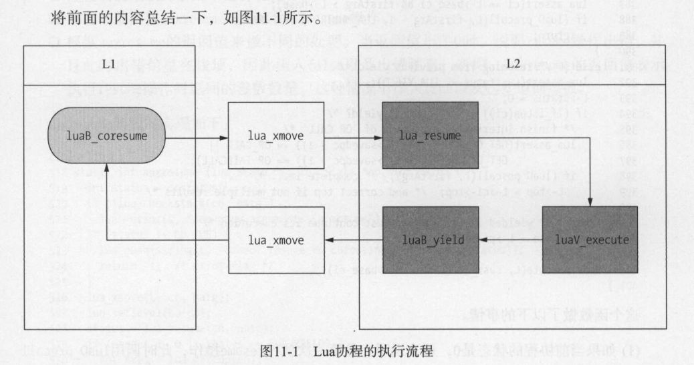

1. 协程的四种状态
```C
// 协程的状态
// 协程正在运行时
#define COS_RUN		0
// 协程运行完尝试运行 或者 在运行代码时发生了错误
#define COS_DEAD	1
// 协程刚被创建时 或者 遇到函数中的yield关键字时，它的状态变为suspended
#define COS_YIELD	2
// 协程处于正常状态，没有运行，协程A中唤醒协程B，A就处于正常状态，B就处于运行状态
#define COS_NORM	3

static const char *const statname[] =
  {"running", "dead", "suspended", "normal"};
```

2. coroutine.create, 创建一个协程，不运行，处于COS_YIELD/"suspended"
```lua
-- 创建协程，没有运行，co是NL
local co = coroutine.create(
    function(arg)
        print("start yield")
        local result = coroutine.yield(arg)
        print("restart co",  result)
        return result * arg
    end
)
```
```C
// 创建一个协程
/*
* 调用本函数结尾
* L:
* [
*   ...(上一个ci)
*   L->ci->func(coroutine.create), 
*   协程函数LClosure, 
*   NL， 
*   L->top(free位置)
* ]
* 
* NL: 
* [
*   NL->ci->func,
*   协程函数LClosure,
*   NL->top(free位置)
* ]
* 
* L调用完成后
* L:
* [
*   ...(上一个ci)
*   NL，
*   L->top(free位置)
* ]
*/
static int luaB_cocreate (lua_State *L) {
  lua_State *NL;
  // 确保当前栈第一个元素是一个函数
  luaL_checktype(L, 1, LUA_TFUNCTION);
  // 创建一个新的lua线程，并且压入栈
  NL = lua_newthread(L);
  // 再次把函数放入栈顶
  lua_pushvalue(L, 1);  /* move function to top */
  // 再将栈顶函数弹出到新的线程
  lua_xmove(L, NL, 1);  /* move function from L to NL */
  return 1;
}
```

3. coroutine.resume，协程的启动(恢复)
```lua
local bRet, val = coroutine.resume(co, 1)
```




4. coroutine.yield，其上从上面的截图可以看出来，实现yield关键就是c语言的特性, setjmp和longjmp
   


5. lua中最后的coroutine.resume(co, 3)，这里的代码注释有点不一样
   
