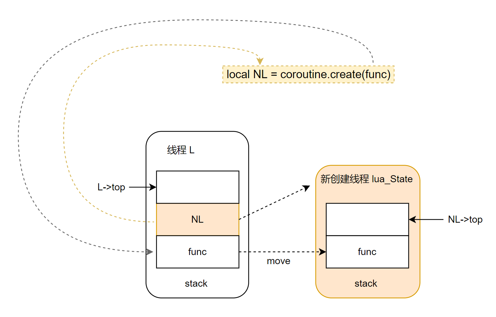
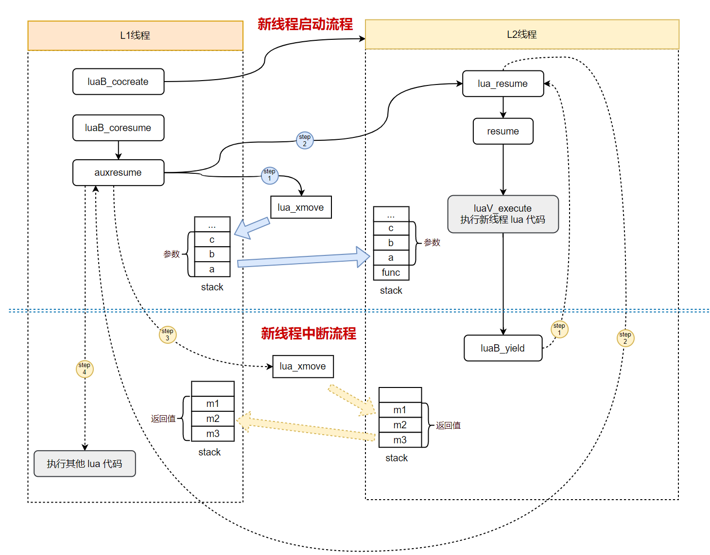

1. 协程的四种状态
```C
// 协程的状态
// 协程正在运行时
#define COS_RUN		0
// 协程运行完尝试运行 或者 在运行代码时发生了错误
#define COS_DEAD	1
// 协程刚被创建时 或者 遇到函数中的yield关键字时，它的状态变为suspended
#define COS_YIELD	2
// 协程处于正常状态，没有运行，协程A中唤醒协程B，A就处于正常状态，B就处于运行状态
#define COS_NORM	3

static const char *const statname[] =
  {"running", "dead", "suspended", "normal"};
```

2. coroutine.create, 创建一个协程，不运行，处于COS_YIELD/"suspended"
```lua
-- 创建协程，没有运行，co是NL
local co = coroutine.create(
    function(arg)
        print("start yield")
        local result = coroutine.yield(arg)
        print("restart co",  result)
        return result * arg
    end
)
```
```C
// 创建一个协程
/*
* 调用本函数结尾
* L:
* [
*   ...(上一个ci)
*   L->ci->func(coroutine.create), 
*   协程函数LClosure, 
*   NL， 
*   L->top(free位置)
* ]
* 
* NL: 
* [
*   NL->ci->func,
*   协程函数LClosure,
*   NL->top(free位置)
* ]
* 
* L调用完成后
* L:
* [
*   ...(上一个ci)
*   NL，
*   L->top(free位置)
* ]
*/
static int luaB_cocreate (lua_State *L) {
  lua_State *NL;
  // 确保当前栈第一个元素是一个函数
  luaL_checktype(L, 1, LUA_TFUNCTION);
  // 创建一个新的lua线程，并且压入栈
  NL = lua_newthread(L);
  // 再次把函数放入栈顶
  lua_pushvalue(L, 1);  /* move function to top */
  // 再将栈顶函数弹出到新的线程
  lua_xmove(L, NL, 1);  /* move function from L to NL */
  return 1;
}
```

图转自：https://www.cnblogs.com/lindx/p/18148365



3. coroutine.resume，协程的启动(恢复)
```lua
local bRet, val = coroutine.resume(co, 1)
```

```C
// 协程的启动(恢复)
static int luaB_coresume (lua_State *L) {
  // 得到协程线程
  lua_State *co = getco(L);
  int r;
  // 核心：启动或者恢复协程
  r = auxresume(L, co, lua_gettop(L) - 1);
  if (l_unlikely(r < 0)) {
    // 失败了，栈中已经有错误信息了，再次压入false
    lua_pushboolean(L, 0);
    // false放到错误信息前面
    // local bRet, val = coroutine.resume(co, 1)
    // OP_CALL,/* A B C R[A], ... ,R[A+C-2] := R[A](R[A+1], ... ,R[A+B-1]) */
    lua_insert(L, -2);
    return 2;  /* return false + error message */
  }
  else {
    // 成功了，栈中已经有r个要返回的值了
    lua_pushboolean(L, 1);
    // 同理
    lua_insert(L, -(r + 1));
    return r + 1;  /* return true + 'resume' returns */
  }
}
```

```C
// 恢复(启动)一个协程
// L原始线程，co要恢复的线程，narg传入参数
static int auxresume (lua_State *L, lua_State *co, int narg) {
  int status, nres;
  // 确保co线程可以容纳narg个参数到栈空间
  if (l_unlikely(!lua_checkstack(co, narg))) {
    lua_pushliteral(L, "too many arguments to resume");
    return -1;  /* error flag */
  }
  // 将原始线程L栈上的narg个参数，复制到目标协程co的栈上
  /*
  * L:
  * [
  * ...(上一个ci)
  * L->ci->func(coroutine.resume),
  * NL(new lua_state)
  * 参数1
  * ...
  * 参数narg
  * L->top(空闲位置)
  * ]
  *
  * NL:
  * [
  * ...(上一个ci)
  * NL->ci->func,
  * 协程函数,
  * NL->top(空闲位置)
  * ]
  */
  lua_xmove(L, co, narg);
  /*
  * L:
  * [
  * ...(上一个ci)
  * L->ci->func(coroutine.resume),
  * NL(new lua_state)
  * L->top(空闲位置)
  * ]
  *
  * NL:
  * [
  * ...(上一个ci)
  * NL->ci->func,
  * 协程函数,
  * 参数1
  * ...
  * 参数narg
  * NL->top(空闲位置)
  * ]
  */
  // 启动(恢复)目标协程co的执行
  status = lua_resume(co, L, narg, &nres);
  if (l_likely(status == LUA_OK || status == LUA_YIELD)) {
    if (l_unlikely(!lua_checkstack(L, nres + 1))) {
      lua_pop(co, nres);  /* remove results anyway */
      lua_pushliteral(L, "too many results to resume");
      return -1;  /* error flag */
    }
    // 将co栈中的返回值移动到原始线程
    /*
    * L:
    * [
    * ...(上一个ci)
    * L->ci->func(coroutine.resume),
    * NL(new lua_state)
    * NL返回值1
    * ...
    * NL返回值nres
    * L->top(空闲位置)
    * ]
    *
    * NL:
    * [
    * ...(上一个ci)
    * NL->top(空闲位置)
    * ]
    */
    lua_xmove(co, L, nres);  /* move yielded values */
    return nres;
  }
  else {
    // 说明发生了错误
    lua_xmove(co, L, 1);  /* move error message */
    return -1;  /* error flag */
  }
}
```

```C
// 启动或者恢复一个协程
// L要执行协程对应的线程
// from原始线程
// nargs L栈中的参数个数
// nresults 返回值个数
LUA_API int lua_resume (lua_State *L, lua_State *from, int nargs,
                                      int *nresults) {
  int status;
  lua_lock(L);
  if (L->status == LUA_OK) {  /* may be starting a coroutine */
    if (L->ci != &L->base_ci)  /* not in base level? */
      // 这里说明打算启动一个新的协程，但是调用栈不是base level，说明里面有其他调用栈存在，这是不允许的
      return resume_error(L, "cannot resume non-suspended coroutine", nargs);
    else if (L->top.p - (L->ci->func.p + 1) == nargs)  /* no function? */
      // 这种说明协程已经执行完了，还想着恢复呢？当然是dead了
      return resume_error(L, "cannot resume dead coroutine", nargs);
  }
  else if (L->status != LUA_YIELD)  /* ended with errors? */
    // 说明出错了
    return resume_error(L, "cannot resume dead coroutine", nargs);
  // 协程的调用是有深度限制的，比如我们resume A协程的时候，
  // A协程内部又去resume B协程，然后B协程内部在自身被resume的过程中又去resume C协程，
  // 然后这一次次的嵌套，在Lua中，会有一个最大的深度限制，就是不能超过LUAI_MAXCCALLS，即下图定义的200
  L->nCcalls = (from) ? getCcalls(from) : 0;
  if (getCcalls(L) >= LUAI_MAXCCALLS)
    return resume_error(L, "C stack overflow", nargs);
  L->nCcalls++;
  luai_userstateresume(L, nargs);
  api_checknelems(L, (L->status == LUA_OK) ? nargs + 1 : nargs);
  // L上保护模式下执行resume，nargs参数个数
  status = luaD_rawrunprotected(L, resume, &nargs);
   /* continue running after recoverable errors */
  // 上面保护模式运行，有可能真的出现了异常，更常见的就是yield，并且这个时候
  // L->status = LUA_YIELD;
  // 如果是正常挂起，这个函数肯定啥也没做，还是返回LUA_YIELD
  status = precover(L, status);
  if (l_likely(!errorstatus(status)))
    lua_assert(status == L->status);  /* normal end or yield */
  else {  /* unrecoverable error */
    L->status = cast_byte(status);  /* mark thread as 'dead' */
    luaD_seterrorobj(L, status, L->top.p);  /* push error message */
    L->ci->top.p = L->top.p;
  }
  // 挂起状态，yield需要返回参数个数,非挂起状态，返回栈内的参数个数
  *nresults = (status == LUA_YIELD) ? L->ci->u2.nyield
                                    : cast_int(L->top.p - (L->ci->func.p + 1));
  lua_unlock(L);
  return status;
}
```

```C
// 保护性调用f
int luaD_rawrunprotected (lua_State *L, Pfunc f, void *ud) {
  l_uint32 oldnCcalls = L->nCcalls;
  // 当前的栈信息保存在了jmp_buf变量lj中
  struct lua_longjmp lj;
  // 状态设置
  lj.status = LUA_OK;
  // 上一个保护状态保存起来
  lj.previous = L->errorJmp;  /* chain new error handler */
  // 执行前f把当前堆栈保存起来，出现异常以后可以恢复
  L->errorJmp = &lj;
  // #define LUAI_TRY(L,c,a)		if (setjmp((c)->b) == 0) { a }
  // #define LUAI_THROW(L,c)		longjmp((c)->b, 1)
  // 当发生LUAI_THROW，还是走到这里，但是不会反复执行要保护的函数
  LUAI_TRY(L, &lj,
    (*f)(L, ud);
  );
  // 恢复上一个保护状态
  L->errorJmp = lj.previous;  /* restore old error handler */
  L->nCcalls = oldnCcalls;
  return lj.status;
}
```

```C
// lua_resume函数的核心逻辑
static void resume (lua_State *L, void *ud) {
  // 参数个数
  int n = *(cast(int*, ud));  /* number of arguments */
  // 第一个参数
  StkId firstArg = L->top.p - n;  /* first argument */
  CallInfo *ci = L->ci;
  if (L->status == LUA_OK)  /* starting a coroutine? */
    // 启动协程
    // 执行协程的主体函数，执行LClosure中的指令，没有yield就执行完，有yield就throw
    ccall(L, firstArg - 1, LUA_MULTRET, 0);  /* just call its body */
  else {  /* resuming from previous yield */
	// 恢复
    lua_assert(L->status == LUA_YIELD);
    // 恢复中断的协程，设置LUA_OK
    L->status = LUA_OK;  /* mark that it is running (again) */
    if (isLua(ci)) {  /* yielded inside a hook? */
      /* undo increment made by 'luaG_traceexec': instruction was not
         executed yet */
      lua_assert(ci->callstatus & CIST_HOOKYIELD);
      ci->u.l.savedpc--;
      L->top.p = firstArg;  /* discard arguments */
      luaV_execute(L, ci);  /* just continue running Lua code */
    }
    else {  /* 'common' yield */
      if (ci->u.c.k != NULL) {  /* does it have a continuation function? */
        lua_unlock(L);
        n = (*ci->u.c.k)(L, LUA_YIELD, ci->u.c.ctx); /* call continuation */
        lua_lock(L);
        api_checknelems(L, n);
      }
      // 退出 luaB_yield 这个 ci，回到上一级调 yield 那个 lua ci 中，并将主线程的传递过来的参数做为新线程的返回值
      luaD_poscall(L, ci, n);  /* finish 'luaD_call' */
    }
    // 继续执行 yield 中断的后续 lua 代码
    unroll(L, NULL);  /* run continuation */
  }
}
```
```C
// 调用c/lua函数
// L线程
// func要调用的函数
// nResults期望的返回值数量
// inc调用深度次数
l_sinline void ccall (lua_State *L, StkId func, int nResults, l_uint32 inc) {
  CallInfo *ci;
  L->nCcalls += inc;
  if (l_unlikely(getCcalls(L) >= LUAI_MAXCCALLS)) {
    checkstackp(L, 0, func);  /* free any use of EXTRA_STACK */
    luaE_checkcstack(L);
  }
  // 不为空就是调用的lua函数
  if ((ci = luaD_precall(L, func, nResults)) != NULL) {  /* Lua function? */
    // 到这里了肯定是lua函数
    ci->callstatus = CIST_FRESH;  /* mark that it is a "fresh" execute */
    luaV_execute(L, ci);  /* call it */
  }
  L->nCcalls -= inc;
}
```

4. coroutine.yield
```LUA
local result = coroutine.yield(arg)
```
```C
// yield
static int luaB_yield (lua_State *L) {
  return lua_yield(L, lua_gettop(L));
}
```

```C
// 协程挂起操作
// L要挂起的协程所在的线程
// nresults返回值个数
// ctx
// k
LUA_API int lua_yieldk (lua_State *L, int nresults, lua_KContext ctx,
                        lua_KFunction k) {
  CallInfo *ci;
  luai_userstateyield(L, nresults);
  lua_lock(L);
  ci = L->ci;
  api_checknelems(L, nresults);
  // 判断当前协程是否可以挂起
  if (l_unlikely(!yieldable(L))) {
    if (L != G(L)->mainthread)
      // (C)lua_resume -> Lua function -> C function 
      // -> (C)lua_call -> Lua function
      // ->coroutine.yield -> (C)lua_yield
      // 上述行为是不允许，这里报错
      luaG_runerror(L, "attempt to yield across a C-call boundary");
    else
      // 主线程不允许挂起
      luaG_runerror(L, "attempt to yield from outside a coroutine");
  }
  // 设置挂起状态
  L->status = LUA_YIELD;
  // 设置参数个数
  ci->u2.nyield = nresults;  /* save number of results */
  if (isLua(ci)) {  /* inside a hook? */
    lua_assert(!isLuacode(ci));
    api_check(L, nresults == 0, "hooks cannot yield values");
    api_check(L, k == NULL, "hooks cannot continue after yielding");
  }
  else {
    if ((ci->u.c.k = k) != NULL)  /* is there a continuation? */
      ci->u.c.ctx = ctx;  /* save context */
    // 挂起
    luaD_throw(L, LUA_YIELD);
  }
  lua_assert(ci->callstatus & CIST_HOOKED);  /* must be inside a hook */
  lua_unlock(L);
  return 0;  /* return to 'luaD_hook' */
}
```

```C
// Lua执行过程中抛出异常
l_noret luaD_throw (lua_State *L, int errcode) {
  if (L->errorJmp) {  /* thread has an error handler? */
    // 说明当前lua_State前面肯定存在一个安全调用，比如：luaD_rawrunprotected，从而触发了异常
    // 所以这里用c函数特性跳转回去
    L->errorJmp->status = errcode;  /* set status */
    LUAI_THROW(L, L->errorJmp);  /* jump to it */
  }
  else {  /* thread has no error handler */
    // 说明当前lua_State前面没有安全调用
    global_State *g = G(L);
    errcode = luaE_resetthread(L, errcode);  /* close all upvalues */
    if (g->mainthread->errorJmp) {  /* main thread has a handler? */
      setobjs2s(L, g->mainthread->top.p++, L->top.p - 1);  /* copy error obj. */
      luaD_throw(g->mainthread, errcode);  /* re-throw in main thread */
    }
    else {  /* no handler at all; abort */
      if (g->panic) {  /* panic function? */
        lua_unlock(L);
        g->panic(L);  /* call panic function (last chance to jump out) */
      }
      abort();
    }
  }
```

**这里实现yield关键就是c语言的特性, `setjmp`和`longjmp`**, if (l_likely(status == LUA_OK || status == LUA_YIELD)) 这个分支里面

```C
/*
** Resumes a coroutine. Returns the number of results for non-error
** cases or -1 for errors.
*/
// 恢复(启动)一个协程
// L原始线程，co要恢复的线程，narg传入参数
static int auxresume (lua_State *L, lua_State *co, int narg) {
  int status, nres;
  // 确保co线程可以容纳narg个参数到栈空间
  if (l_unlikely(!lua_checkstack(co, narg))) {
    lua_pushliteral(L, "too many arguments to resume");
    return -1;  /* error flag */
  }
  // 将原始线程L栈上的narg个参数，复制到目标协程co的栈上
  /*
  * L:
  * [
  * ...(上一个ci)
  * L->ci->func(coroutine.resume),
  * NL(new lua_state)
  * 参数1
  * ...
  * 参数narg
  * L->top(空闲位置)
  * ]
  *
  * NL:
  * [
  * ...(上一个ci)
  * NL->ci->func,
  * 协程函数,
  * NL->top(空闲位置)
  * ]
  */
  lua_xmove(L, co, narg);
  /*
  * L:
  * [
  * ...(上一个ci)
  * L->ci->func(coroutine.resume),
  * NL(new lua_state)
  * L->top(空闲位置)
  * ]
  *
  * NL:
  * [
  * ...(上一个ci)
  * NL->ci->func,
  * 协程函数,
  * 参数1
  * ...
  * 参数narg
  * NL->top(空闲位置)
  * ]
  */
  // 启动(恢复)目标协程co的执行
  status = lua_resume(co, L, narg, &nres);
  if (l_likely(status == LUA_OK || status == LUA_YIELD)) {
    if (l_unlikely(!lua_checkstack(L, nres + 1))) {
      lua_pop(co, nres);  /* remove results anyway */
      lua_pushliteral(L, "too many results to resume");
      return -1;  /* error flag */
    }
    // 将co栈中的返回值移动到原始线程
    /*
    * L:
    * [
    * ...(上一个ci)
    * L->ci->func(coroutine.resume),
    * NL(new lua_state)
    * NL返回值1
    * ...
    * NL返回值nres
    * L->top(空闲位置)
    * ]
    *
    * NL:
    * [
    * ...(上一个ci)
    * NL->top(空闲位置)
    * ]
    */
    lua_xmove(co, L, nres);  /* move yielded values */
    return nres;
  }
  else {
    // 说明发生了错误
    lua_xmove(co, L, 1);  /* move error message */
    return -1;  /* error flag */
  }
}
```

5. coroutine.resume
```LUA
bRet, val = coroutine.resume(co, 2)
```

```C
// 还是同样的流程
// lua_resume函数的核心逻辑
static void resume (lua_State *L, void *ud) {
  // 参数个数
  int n = *(cast(int*, ud));  /* number of arguments */
  // 第一个参数
  StkId firstArg = L->top.p - n;  /* first argument */
  CallInfo *ci = L->ci;
  if (L->status == LUA_OK)  /* starting a coroutine? */
    // 启动协程
    // 执行协程的主体函数，执行LClosure中的指令，没有yield就执行完，有yield就throw
    ccall(L, firstArg - 1, LUA_MULTRET, 0);  /* just call its body */
  else {  /* resuming from previous yield */
	// 恢复执行 yield 中断后的逻辑，L->status 状态一定是挂起的
    lua_assert(L->status == LUA_YIELD);
    // 恢复中断的协程，设置LUA_OK
    L->status = LUA_OK;  /* mark that it is running (again) */
    if (isLua(ci)) {  /* yielded inside a hook? */
      /* undo increment made by 'luaG_traceexec': instruction was not
         executed yet */
      lua_assert(ci->callstatus & CIST_HOOKYIELD);
      ci->u.l.savedpc--;
      L->top.p = firstArg;  /* discard arguments */
      luaV_execute(L, ci);  /* just continue running Lua code */
    }
    else {  /* 'common' yield */
      if (ci->u.c.k != NULL) {  /* does it have a continuation function? */
        lua_unlock(L);
        n = (*ci->u.c.k)(L, LUA_YIELD, ci->u.c.ctx); /* call continuation */
        lua_lock(L);
        api_checknelems(L, n);
      }
      // 退出 luaB_yield 这个 ci，回到上一级调 yield 那个 lua ci 中，并将主线程的传递过来的参数做为新线程的返回值
      luaD_poscall(L, ci, n);  /* finish 'luaD_call' */
    }
    // 继续执行 yield 中断的后续 lua 代码
    unroll(L, NULL);  /* run continuation */
  }
}
```
关键点，具体看注释即可

**luaD_poscall(L, ci, n);**

**unroll(L, NULL);**

```C
// 继续执行 yield 中断的后续 lua 代码
static void unroll (lua_State *L, void *ud) {
  CallInfo *ci;
  UNUSED(ud);
  while ((ci = L->ci) != &L->base_ci) {  /* something in the stack */
    if (!isLua(ci))  /* C function? */
      finishCcall(L, ci);  /* complete its execution */
    else {  /* Lua function */
      // yield前的指令补全，先检测下前一条指令，是否有需要补全的，如果有就补全指令剩余逻辑
      luaV_finishOp(L);  /* finish interrupted instruction */
      // 继续执行yield后的逻辑
      luaV_execute(L, ci);  /* execute down to higher C 'boundary' */
    }
  }
}
``` 

补全如果感兴趣，可以看(https://www.cnblogs.com/lindx/p/18148365)

6. lua协程执行流程，图转自：https://www.cnblogs.com/lindx/p/18148365


  


7. 如何实现 C 调用中的 Continuation, 来自云风的BLOG(https://blog.codingnow.com/2012/06/continuation_in_lua_52.html)
> Lua 5.2 最重大的改进，莫过于 "yieldable pcall and metamethods" 。这需要克服一个难题：如何在 C 函数调用中，正确的 yield 回 resume 调用的位置。
resume 的发起总是通过一次 lua_resume 的调用，在 Lua 5.1 以前，yield 的调用必定结束于一次 lua_yield 调用，而调用它的 C 函数必须立刻返回。中间不能有任何 C 函数执行到中途的状态。这样，Lua VM 才能正常工作。

> (C)lua_resume -> Lua functions -> coroutine.yield
  -> (C)lua_yield -> (C) return

> 在这个流程中，无论 Lua functions 有多少层，都被 lua state 中的 lua stack 管理。所以当最后 C return 返回到最初 resume 点 ，都不存在什么问题，可以让下一次 resume 正确继续。也就是说，在 yield 时，lua stack 上可以有没有执行完的 lua 函数，但不可以有没有执行完的 C 函数。

> 如果我们写了这么一个 C 扩展，在 C function 里回调了传入的一个 Lua 函数。情况就变得不一样了。

> (C)lua_resume -> Lua function -> C function 
  -> (C) lua_call  -> Lua function 
  -> coroutine.yield -> (C)lua_yield 

> C 通过 lua_call 调用的 Lua 函数中再调用 coroutine.yield 会导致在 yield 之后，再次 resume 时，不再可能从 lua_call 的下一行继续运行。lua 在遇到这种情况时，会抛出一个异常 "attempt to yield across metamethod/C-call boundary" 。

> 在 5.2 之前，有人试图解决这个问题，去掉 coroutine 的这些限制。比如 Coco 这个项目。它用操作系统的协程来解决这个问题 (例如，在 Windows 上使用 Fiber )。即给每个 lua coroutine 真的附在一个 C 协程上，独立一个 C 堆栈。

> 这样的方案开销较大，且依赖平台特性。到了 Lua 5.2 中，则换了一个更彻底的方案解决这个问题。

> 其实，需要解决的问题是在 C 和 Lua 的边界时，如果在 yield 之后，resume 如何继续运行 C 边界之后的 C 代码。

> 当只有一个 C 堆栈时，只能从调用深处跳出来（使用 longjmp），却无法回到那个位置（因为一旦跳出，堆栈就被破坏）。Lua 5.2 想了一个巧妙的方法来解决这个问题。

> C 进入 Lua 的边界一共有四个 API ：lua_call , lua_pcall , lua_resume 和 lua_yield 。其中要解决的关键问题在于 call 一个 lua function 有两条返回路径。

> lua function 的正常返回应该执行 lua_call 调用后面的 C 代码，而中途如果 yield 发生，回导致执行序回到前面 lua_resume 调用处的下一行 C 代码执行。对于后一种，在后续的某次 lua_resume 发生后，lua coroutine 结束，还需要回到 lua_call 之后完成后续的 C 执行逻辑。C 语言是不允许这样做的，因为当初的 C 堆栈已经不存在了。

> Lua 5.2 提供了新的 API ：lua_callk 来解决这个问题。既然无法在 yield 之后，C 的执行序无法回到 lua_callk 的下一行代码，那么就让 C 语言使用者自己提供一个 Continuation 函数 k 来继续。

> 我们可以这样理解 k 这个参数：当 lua_callk 调用的 lua 函数中没有发生 yield 时，它会正常返回。一旦发生 yield ，调用者要明白，C 代码无法正常延续，而 lua vm 会在需要延续时调用 k 来完成后续工作。

> k 会得到正确的 L 保持正确的 lua state 状态，看起来就好像用一个新的 C 执行序替代掉原来的 C 执行序一样。

> 典型的用法就是在一个 C 函数调用的最后使用 callk ：
```c
  lua_callk(L, 0, LUA_MULTRET, 0, k);
  return k(L);
```

> 也就是把 callk 后面的执行逻辑放在一个独立 C 函数 k 中，分别在 callk 后调用它，或是传递给框架，让框架在 resume 后调用。

> 这里，lua 状态机的状态被正确保存在 L 中，而 C 函数堆栈会在 yield 后被破坏掉。如果我们需要在 k 中得到延续点前的 C 函数状态怎么办呢？lua 提供了 ctx 用于辅助记录 C 中的状态。

> 在 k 中，可以通过 lua_getctx 获得最近一次边界调用时传入的 k 。lua_getctx 返回两个参数，分别是 k 和当前所处的执行位置。是原始函数（没有被 yield 打断的），还是在被 yield 打断后的延续点函数中。这有一点点像 setjmp 或 fork 的接口设计。

