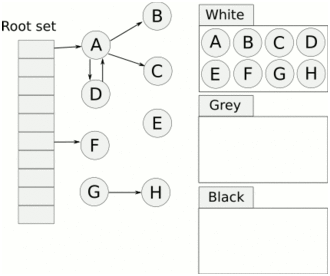

1. lua中需要GC的对象
```C
/*
** basic types
*/
#define LUA_TNONE		(-1)

#define LUA_TNIL		0
#define LUA_TBOOLEAN		1
#define LUA_TLIGHTUSERDATA	2
#define LUA_TNUMBER		3
// 这个下面都是需要GC
#define LUA_TSTRING		4
#define LUA_TTABLE		5
#define LUA_TFUNCTION		6
#define LUA_TUSERDATA		7
#define LUA_TTHREAD		8

#define LUA_NUMTYPES		9

/*
** Common Header for all collectable objects (in macro form, to be
** included in other objects)
*/
// 这是所有GC对象的公共头部
// next - 下一个GCObject指针
// tt - 类型
// marked - GC状态标记
#define CommonHeader	struct GCObject *next; lu_byte tt; lu_byte marked


/* Common type for all collectable objects */
// 所有GC对象的父类
typedef struct GCObject {
  CommonHeader;
} GCObject;


// 模拟父类向子类转换的中间态，主要是目的就是转换
// 这里都是能被GC回收的对象
union GCUnion {
  GCObject gc;  /* common header */
  // lua string
  struct TString ts;
  // full user data
  struct Udata u;
  union Closure cl;
  // lua table
  struct Table h;
  struct Proto p;
  struct lua_State th;  /* thread */
  struct UpVal upv;
};

// 其他需要GC的类型不展示
/*
** Header for a string value.
*/
// 字符串类型
typedef struct TString {
  // GC对象的公共头部
  CommonHeader;
  // TString为⻓字符串时：当extra=0时表示该字符串未进⾏哈希运算；当extra=1时表示该字符串已经进⾏过哈希运算。
  // TString为短字符串时：当extra=0时表示它是普通字符串；当extra不为0时，它⼀般是lua保留字。
  lu_byte extra;  /* reserved words for short strings; "has hash" for longs */
  // 短字符串长度
  lu_byte shrlen;  /* length for short strings, 0xFF for long strings */
  // 字符串哈希值
  unsigned int hash;
  // 这是⼀个union结构。当TString为短字符串时，hnext域有效。当全局字符串表有其他字
  // 符串哈希冲突时，会将这些冲突的TString实例链接成单向链表，hnext的作⽤则是指向下⼀个
  // 对象在哪个位置。当TString为⻓字符串时，lnglen域⽣效，并且表示⻓字符串的⻓度也就是字
  // 符串Body的⻓度。
  union {
    size_t lnglen;  /* length for long strings */
    struct TString *hnext;  /* linked list for hash table */
  } u;
  // 这个是⽤来标记字符串Body起始位置的，配合shrlen或lnglen使⽤，能够找到字符串Body的结束位置在哪⾥
  char contents[1];
} TString;

/*
** Union of all Lua values
*/
// lua boolean 在类型字段中定义
typedef union Value {
  // 指向需要GC的对象
  struct GCObject *gc;    /* collectable objects */
  // light userdata
  void *p;         /* light userdata */
  // light c function
  lua_CFunction f; /* light C functions */
  // 整数
  lua_Integer i;   /* integer numbers */
  // 浮点数
  lua_Number n;    /* float numbers */
  /* not used, but may avoid warnings for uninitialized value */
  lu_byte ub;
} Value;

// value_ - 值
// 
// tt_ - 类型
// bit 0 ~ 3: 这里4个位，2的4次方即可以代表16个数值，用于存储变量的基本类型
// bit 4 ~ 5: 这里2个位，2的2次方即可以代表4个数值，用于存放类型变体，类型变体也属于它0到3位所对应的的基本类型
// bit     6: 这里1个位，2的1次方即可以代表2个数值，用于存储该变量是否可以垃圾回收
#define TValuefields	Value value_; lu_byte tt_

// Lua虚拟机中用于表示所有数据类型
typedef struct TValue {
  TValuefields;
} TValue;
```

2. GC对象如何被分配
```C
/*
** create a new collectable object (with given type, size, and offset)
** and link it to 'allgc' list.
*/
GCObject *luaC_newobjdt (lua_State *L, int tt, size_t sz, size_t offset) {
  global_State *g = G(L);
  char *p = cast_charp(luaM_newobject(L, novariant(tt), sz));
  GCObject *o = cast(GCObject *, p + offset);
  o->marked = luaC_white(g);
  o->tt = tt;
  o->next = g->allgc;
  g->allgc = o;
  return o;
}
```

3. 早期lua5.0，双色标记清楚算法，缺点就是需要STW(stop the world)


4. lua5.1以后，三色标记清除算法，不再要求GC一次性扫描完所有的对象，这个GC过程可以是增量的，可以被中断再恢复并继续进行
   


5. 三色标记清除算法缺点，引用自(https://zhuanlan.zhihu.com/p/601609031)：
  - >总任务量变大：算法是增量式的，每执行一部分任务量就可以先自行中断等待下次GC触发时继续执行剩余的部分，若中断后当前已经被处理过的对象状态发生了改变，会影响到颜色标记，导致下一次继续执行的时候又需要再次处理该对象。所以会存在一些频繁改变的对象被重复处理好几次的问题，使得GC的整体任务量增大了。
  - >及时性不足：增量式算法中所有对象是同等处理的，无论是刚创建的对象，还是在系统中存活了很多年的对象；算法流程也是线性往前的，由标记阶段，原子阶段，清除阶段这样按顺序由前往后依次执行。
  - >算法性能无法收敛：商业化的应用往往要求程序能持久地运行，在程序运行了较长时间之后，系统往往会趋向于一个稳定的状态，需要执行逻辑的内存对象基本已经全部分配好了（暂不考虑完全不使用内存池或缓存技术的框架），不需要再为内存分配而消耗性能，此时Lua中累积分配的内存对象可能会很多，但其中大多数又是有用的。

6. lua5.4以后，在三色标记清除算法基础上增加分代GC，准确的说又加回来，5.2就加了，5.3又删除了，下面图文引用自(http://manistein.club/post/program/garbage-collection/%E5%88%86%E4%BB%A3gc%E6%B5%85%E6%9E%90/)
   


> 与增进式GC不同的是，分代GC几乎每次GC都有机会及时清除掉不可达的GC object，因此既不需要像简单标记清除算法那样进行全量GC，又不需要像增进式GC那样，在graylist清空之前不能清除不可达对象，从而导致内存峰值不好控制的问题。

1. 三色标记清楚算法一些补充，三色标记清除算法存在对象丢失，需要额外的机制保证，这些机制一般称作屏障，下面图文引用自(https://www.cnblogs.com/cxy2020/p/16321884.html)
  
	

	

	

	

> 在三色标记法的过程中对象丢失，需要同时满足下面两个条件：
> 
> 条件一：白色对象被黑色对象引用
> 
> 条件二：灰色对象与白色对象之间的可达关系遭到破坏
> 
> 只要把上面两个条件破坏掉一个，就可以保证对象不丢失，golang团队就提出了两种破坏条件的方式：强三色不变式和弱三色不变式。
>
> 强三色不变式
>
> 规则：不允许黑色对象引用白色对象，破坏了条件一： 白色对象被黑色对象引用
>
> 弱三色不变式
> 
> 规则：黑色对象可以引用白色对象，但是白色对象的上游必须存在灰色对象，破坏了条件二：灰色对象与白色对象之间的可达关系遭到破坏
>
> 