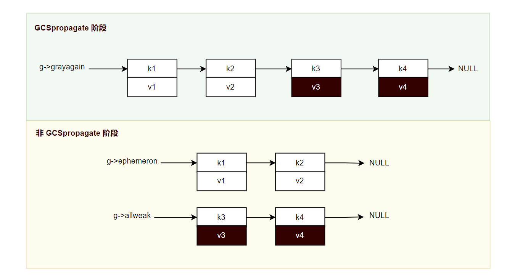

1. 开启三色标记清除算法
```lua
collectgarbage("incremental")
```
```c
/* kinds of Garbage Collection */
// 增量
#define KGC_INC		0	/* incremental gc */
// 分代
#define KGC_GEN		1	/* generational gc */

/*
** Change collector mode to 'newmode'.
*/
// GC算法切换
void luaC_changemode (lua_State *L, int newmode) {
	global_State *g = G(L);
	if (newmode != g->gckind) {
		if (newmode == KGC_GEN)  /* entering generational mode? */
			entergen(L, g);
		else
			enterinc(g);  /* entering incremental mode */
	}
	g->lastatomic = 0;
}
```

2. global_State中关于三色标记清除相关的数据
```C
typedef struct global_State {
	...
	// 债务(需要回收的内存数量)，负数代表预充值多少金额到系统，正数代表需要偿还多少债务。
	l_mem GCdebt;  /* bytes allocated not yet compensated by the collector */
	// 所有GC对象创建之后都会放入该链表中
	GCObject *allgc;  /* list of all collectable objects */
	// 三色标记清除：回收链表，因为回收阶段可以分步进行，所以需要保存当前回收的位置,下一次从这个位置开始继续回收操作
	GCObject **sweepgc;  /* current position of sweep in list */
	// 三色标记清除：具有__gc元方法的GC对象链表
	GCObject *finobj;  /* list of collectable objects with finalizers */
	// 三色标记清楚：灰色链表
	GCObject *gray;  /* list of gray objects */
	// 具有open upvalue的状态机链表，只要当线程L第一次创建开放上值时，它需要被添加到G(L)->twups指向的链表中
	// G->twups => LN->twups => LN-1->twups => ... L1-> twups => NULL
	struct lua_State *twups;  /* list of threads with open upvalues */
	// 存放弱值表的链表，等待GC完成对强可达对象的标记，这个时候就可以处理该weak链表，还是iscleared就可以从数组和hash中移除了
	GCObject *weak;  /* list of tables with weak values */
  	// 三色标记清除：后向屏障对象，常见的比如table，在原子阶段需要再次标记扫描
  	GCObject *grayagain;  /* list of objects to be traversed atomically */
  	// 存放弱键表的链表，原子阶段，如果发现 key 是 gc 对象，并且是白色，值也是白色，加入到 g->ephemeron 链表
  	GCObject *ephemeron;  /* list of ephemeron tables (weak keys) */
  	// 存放纯弱表 和 弱键表中key为白色，值为黑色 的链表
  	GCObject *allweak;  /* list of all-weak tables */
  	// 对象带有 __gc 元方法，原子阶段还是白色的对象都会记录在这个链表中
  	GCObject *tobefnz;  /* list of userdata to be GC */
	...
};
```

3. 三色标记清楚算法流程概述：
	 
4. 三色标记清楚算法流程拆分：
	- GC开始阶段，标记，GCSpause
	```c
	case GCSpause: {
		// 开启新一轮增量GC，不可以分步进行
		// 标记
		restartcollection(g);
		// 切换到扫描阶段
		g->gcstate = GCSpropagate;
		work = 1;
		break;
	}

	/*
	** mark root set and reset all gray lists, to start a new collection
	*/
	// 标记
	static void restartcollection (global_State *g) {
		// 清空灰色链表和弱表相关
		cleargraylists(g);
		// 标记主状态机为灰色
		markobject(g, g->mainthread);
		// 标记全局注册表为灰色
		markvalue(g, &g->l_registry);
		// 标记基础类型对应的全局元表为灰色
		markmt(g);
		// 
		markbeingfnz(g);  /* mark any finalizing object left from previous cycle */
	}
	```

	- GC扫描阶段，GCSpropagate，这个阶段是可以分步进行
	```C
	case GCSpropagate: {
		// 扫描
		if (g->gray == NULL) {  /* no more gray objects? */
			g->gcstate = GCSenteratomic;  /* finish propagate phase */
			work = 0;
		}
		else
			work = propagatemark(g);  /* traverse one gray object */
		break;
	}

	// 颜色扫描
	static lu_mem propagatemark (global_State *g) {
		GCObject *o = g->gray;
		// 自己标记为黑色
		nw2black(o);
		// 从gray脱离
		g->gray = *getgclist(o);  /* remove from 'gray' list */
		// 扫描所引用的内容
		switch (o->tt) {
			case LUA_VTABLE: return traversetable(g, gco2t(o));
			case LUA_VUSERDATA: return traverseudata(g, gco2u(o));
			case LUA_VLCL: return traverseLclosure(g, gco2lcl(o));
			case LUA_VCCL: return traverseCclosure(g, gco2ccl(o));
			case LUA_VPROTO: return traverseproto(g, gco2p(o));
			case LUA_VTHREAD: return traversethread(g, gco2th(o));
			default: lua_assert(0); return 0;
		}
	}
	```
	```C
	// 遍历table，标记所有可达的结点
	static lu_mem traversetable (global_State *g, Table *h) {
		const char *weakkey, *weakvalue;
		// 从元表中获取弱表信息
		const TValue *mode = gfasttm(g, h->metatable, TM_MODE);
		TString *smode;
		// 元表标记
		markobjectN(g, h->metatable);
		/*
		* local clearValue = {"123"}
		* local t = {
		*     ["value_key"] = clearValue
		* }
		* -- 声明值为弱引用
		* setmetatable(t, {__mode = "v"})
		* 
		* -- set value to nil
		* clearValue = nil
		* 
		* --  手动执行gc回收操作
		* collectgarbage()
		* 
		* print(t["value_key"])
		*/
		// 1)"k": 声明键为弱引用，当键被置空时，table会清除这个结点
		// 2)"v": 声明值为弱引用，当值被置空时，table会清除这个结点
		// 3)"kv": 声明键和值都为弱引用，当其中一个被置空时，table会清除这个结点
		if (mode && ttisshrstring(mode) &&  /* is there a weak mode? */
				(cast_void(smode = tsvalue(mode)),
				cast_void(weakkey = strchr(getshrstr(smode), 'k')),
				cast_void(weakvalue = strchr(getshrstr(smode), 'v')),
				(weakkey || weakvalue))) {  /* is really weak? */
			if (!weakkey)  /* strong keys? */
				// 值为弱引用
				traverseweakvalue(g, h);
			else if (!weakvalue)  /* strong values? */
				// 键为弱引用
				traverseephemeron(g, h, 0);
			else  /* all weak */
				// 代表键与值都为弱引用，直接把当前这个table链接到待gc垃圾回收的链表中，后面若没有其它对象标记这个表内的元素，则将被全部清除
				linkgclist(h, g->allweak);  /* nothing to traverse now */
		}
		else  /* not weak */
			// 说明没设置__mode，都是强引用
			traversestrongtable(g, h);
		return 1 + h->alimit + 2 * allocsizenode(h);
	}

	// 遍历full user data，标记所有可达的结点
	static int traverseudata (global_State *g, Udata *u) {
		int i;
		markobjectN(g, u->metatable);  /* mark its metatable */
		for (i = 0; i < u->nuvalue; i++)
			markvalue(g, &u->uv[i].uv);
		genlink(g, obj2gco(u));
		return 1 + u->nuvalue;
	}

	// 遍历lua闭包，标记所有可达的结点
	static int traverseLclosure (global_State *g, LClosure *cl) {
		int i;
		markobjectN(g, cl->p);  /* mark its prototype */
		for (i = 0; i < cl->nupvalues; i++) {  /* visit its upvalues */
			UpVal *uv = cl->upvals[i];
			markobjectN(g, uv);  /* mark upvalue */
		}
		return 1 + cl->nupvalues;
	}

	// 遍历C闭包，标记所有可达的结点
	static int traverseCclosure (global_State *g, CClosure *cl) {
		int i;
		for (i = 0; i < cl->nupvalues; i++)  /* mark its upvalues */
			markvalue(g, &cl->upvalue[i]);
		return 1 + cl->nupvalues;
	}

	// 遍历函数原型类型，标记所有可达的结点
	static int traverseproto (global_State *g, Proto *f) {
		int i;
		markobjectN(g, f->source);
		for (i = 0; i < f->sizek; i++)  /* mark literals */
			markvalue(g, &f->k[i]);
		for (i = 0; i < f->sizeupvalues; i++)  /* mark upvalue names */
			markobjectN(g, f->upvalues[i].name);
		for (i = 0; i < f->sizep; i++)  /* mark nested protos */
			markobjectN(g, f->p[i]);
		for (i = 0; i < f->sizelocvars; i++)  /* mark local-variable names */
			markobjectN(g, f->locvars[i].varname);
		return 1 + f->sizek + f->sizeupvalues + f->sizep + f->sizelocvars;
	}

	// 遍历线程（协程），标记所有可达的结点
	static int traversethread (global_State *g, lua_State *th) {
		UpVal *uv;
		StkId o = th->stack.p;
		if (isold(th) || g->gcstate == GCSpropagate)
			// 因为在GC的扫描阶段，可以分步，Lua代码可能仍然在运行并修改线程栈，所以GC无法保证一次扫描就能标记所有可达对象，
			// 将线程放入grayagain列表，意味着GC会在原子阶段（GCSatomic）再次安全地扫描它。
			linkgclist(th, g->grayagain);  /* insert into 'grayagain' list */
		if (o == NULL)
			return 1;  /* stack not completely built yet */
		lua_assert(g->gcstate == GCSatomic ||
							th->openupval == NULL || isintwups(th));
		// 标记栈上的值
		for (; o < th->top.p; o++)  /* mark live elements in the stack */
			markvalue(g, s2v(o));
		// 标记open upvalue
		for (uv = th->openupval; uv != NULL; uv = uv->u.open.next)
			markobject(g, uv);  /* open upvalues cannot be collected */
		if (g->gcstate == GCSatomic) {  /* final traversal? */
			if (!g->gcemergency)
				luaD_shrinkstack(th); /* do not change stack in emergency cycle */
			for (o = th->top.p; o < th->stack_last.p + EXTRA_STACK; o++)
				setnilvalue(s2v(o));  /* clear dead stack slice */
			/* 'remarkupvals' may have removed thread from 'twups' list */
			if (!isintwups(th) && th->openupval != NULL) {
				// remarkupvals 可能会将线程从twups链表中移除，这里再加回去
				th->twups = g->twups;  /* link it back to the list */
				g->twups = th;
			}
		}
		return 1 + stacksize(th);
	}
	```

	- 这里仔细看看表的操作
		- 强表, 无需多言
		```C
		// 遍历table，标记所有可达的结点
		static void traversestrongtable (global_State *g, Table *h) {
			Node *n, *limit = gnodelast(h);
			unsigned int i;
			unsigned int asize = luaH_realasize(h);
			for (i = 0; i < asize; i++)  /* traverse array part */
				markvalue(g, &h->array[i]);
			for (n = gnode(h, 0); n < limit; n++) {  /* traverse hash part */
				if (isempty(gval(n)))  /* entry is empty? */
					clearkey(n);  /* clear its key */
				else {
					lua_assert(!keyisnil(n));
					markkey(g, n);
					markvalue(g, gval(n));
				}
			}
			genlink(g, obj2gco(h));
		}
		```
		- 弱值表
		> 对于弱值表的处理，在GC的propagate阶段，塞入grayagain列表。在GC的atomic阶段，则需要经历先扫描，再标记，再塞入weak列表，最后清理weak列表引用的过程。
		>
		> 在原子阶段，Lua虚拟机扫描它时，并不会对array部分进行任何处理，如果一个弱值表的array部分不为空，那么这个表一定会被塞入到weak列表中。具体还是看下面注释源码注释把，写的很清楚了
		
		```C
		// 遍历弱值表，扫描阶段时，那些值为空了，就直接清理k-v了，再放入grayagain中，等待原子阶段处理。
		// 原子阶段，那些值为空了，就直接清理k-v了，如果数组或者hash部分的值还存在白色对象，需要被清除，这个时候放入weak链表，
		// 等待GC完成对强可达对象的标记，这个时候就可以处理该weak链表，还是iscleared就可以从数组和hash中移除了。其实这个工作还是
		// 在原子阶段，具体可以搜atomic 函数中 调用clearbyvalues阶段
		static void traverseweakvalue (global_State *g, Table *h) {
			Node *n, *limit = gnodelast(h);
			/* if there is array part, assume it may have white values (it is not
				worth traversing it now just to check) */
			// 原子阶段有效，只要数组有东西就假设里面有需要被清理的对象，直接放入weak就好。
			// 这个阶段没必要对数组进行遍历，等待GC完成对强可达对象的标记，在进行遍历处理即可，算是优化
			int hasclears = (h->alimit > 0);
			for (n = gnode(h, 0); n < limit; n++) {  /* traverse hash part */
				// 值为空(nil)，对应的键如果是可回收，就需要把键 key_tt 标记为 LUA_TDEADKEY
				if (isempty(gval(n)))  /* entry is empty? */
					clearkey(n);  /* clear its key */
				else {
					lua_assert(!keyisnil(n));
					// 只需要标记键
					markkey(g, n);
					// 原子阶段，没有数组部分，hash部分有白色对象，还是需要放入weak链表
					if (!hasclears && iscleared(g, gcvalueN(gval(n))))  /* a white value? */
						hasclears = 1;  /* table will have to be cleared */
				}
			}
			if (g->gcstate == GCSatomic && hasclears)
				// 等待GC完成对强可达对象的标记，才可以处理弱值表
				linkgclist(h, g->weak);  /* has to be cleared later */
			else
				// 确保了所有弱引用表都会在后续的原子阶段被再次检查​​，这是必须的，因为当前传播阶段对象的状态可能还在变化
				linkgclist(h, g->grayagain);  /* must retraverse it in atomic phase */
		}

		// 用于判断弱引用表中的键或值是否可以被清除
		static int iscleared (global_State *g, const GCObject *o) {
			if (o == NULL) return 0;  /* non-collectable value */ // 非回收对象，是非cleared
			else if (novariant(o->tt) == LUA_TSTRING) {
				// 在弱表的上下文中，字符串被当作强引用来对待，永远不会被清除
				// 这样做猜测是因为lua短字符串被内部化了，字符串允许弱引用，垃圾收集器就需要花费大量额外的工作来跟踪和可能回收它们，
				// 这会降低 GC 的效率
				markobject(g, o);  /* strings are 'values', so are never weak */
				return 0;
			}
			else return iswhite(o);
		}
		```

		- 弱键表
		> 弱键扫描，主要分为数组部分，以及哈希表部分，对于数组部分，因为 key 都是数字，不是 gc 对象，不可回收，所以直接对 value 标记灰色，加入灰色链表就可以了。
		> 
		> 哈希部分，值为空(nil)，对应的键如果是可回收，就需要把键 key_tt 标记为 LUA_TDEADKEY，注意，这里并没有对 key 置为 nil，因为有可能这个 key 在 for ... pairs 循环时迭代用到。
		> 
		> 哈希部分，key 是非 gc 对象和 string 对象，所以直接对 value 标记灰色，加入灰色链表就可以了。
		> 
		> 哈希部分，对于 key 都是 gc 对象，被标记了，对应的 value 自然也需要标记，加入灰色链表就可以了。
		> 
		> 扫描阶段，会将这个表放入 grayagain 链表中，在原子阶段再进行处理
		> 
		> 原子阶段，如果发现 key 是 gc 对象，并且是白色，值也是白色，加入到 g->ephemeron 链表
		> 
		> 原子阶段，如果发现 key 是 gc 对象，并且是白色，值被标记了，加入到 g->allweak 链表
		> 
		> 下图来源：https://www.cnblogs.com/lindx/p/17590725.html

		

		```C
		// 遍历弱键表，扫描阶段，直接放入 g->grayagain。等待原子阶段处理。
		// 原子阶段，如果存在 white-key -> white-value，放入 g->ephemeron。
		// 原子阶段，white-key -> not white-value, 放入 g->allweak
		static int traverseephemeron (global_State *g, Table *h, int inv) {
			// 1 - 有value被标记
			int marked = 0;  /* true if an object is marked in this traversal */
			// 1 - 存在白色key
			int hasclears = 0;  /* true if table has white keys */
			// 1 - 存在key和value都是白色的，未被标记的对象
			int hasww = 0;  /* true if table has entry "white-key -> white-value" */
			unsigned int i;
			unsigned int asize = luaH_realasize(h);
			unsigned int nsize = sizenode(h);
			/* traverse array part */
			for (i = 0; i < asize; i++) {
				// 数组下标对应的值只要是可回收对象就进行标记
				if (valiswhite(&h->array[i])) {
					marked = 1;
					reallymarkobject(g, gcvalue(&h->array[i]));
				}
			}
			/* traverse hash part; if 'inv', traverse descending
				(see 'convergeephemerons') */
			for (i = 0; i < nsize; i++) {
				// 倒序或者正序遍历节点
				Node *n = inv ? gnode(h, nsize - 1 - i) : gnode(h, i);
				if (isempty(gval(n)))  /* entry is empty? */
					// 值为空(nil)，对应的键如果是可回收，就需要把键 key_tt 标记为 LUA_TDEADKEY
					clearkey(n);  /* clear its key */
				else if (iscleared(g, gckeyN(n))) {  /* key is not marked (yet)? */
					// key没被标记
					hasclears = 1;  /* table must be cleared */
					if (valiswhite(gval(n)))  /* value not marked yet? */
						// 并且值也没被标记，也就是white-white entry，key和value都是白色的，未被标记的对象
						hasww = 1;  /* white-white entry */
				}
				else if (valiswhite(gval(n))) {  /* value not marked yet? */
					// key被标记了，但是值没有被标记，肯定是需要标记值
					marked = 1;
					reallymarkobject(g, gcvalue(gval(n)));  /* mark it now */
				}
			}
			/* link table into proper list */
			if (g->gcstate == GCSpropagate)
				// 只要是扫描阶段，都直接放入grayagain链表中，留到atomic阶段再处理
				linkgclist(h, g->grayagain);  /* must retraverse it in atomic phase */
			else if (hasww)  /* table has white->white entries? */
				// 肯定是到了原子阶段，如果发现 key 是 gc 对象，并且是白色，值也是白色，加入到 g->ephemeron 链表
				linkgclist(h, g->ephemeron);  /* have to propagate again */
			else if (hasclears)  /* table has white keys? */
				// 肯定是到了原子阶段，如果发现 key 是 gc 对象，并且是白色，值已经被标记，加入到 g->allweak 链表
				linkgclist(h, g->allweak);  /* may have to clean white keys */
			else
				genlink(g, obj2gco(h));  /* check whether collector still needs to see it */
			return marked;
		}
		```

		- 纯弱表，直接放入allweak中
		```C
		linkgclist(h, g->allweak);
		```

	- 扫描阶段是可以分步进行，那就存在一个问题，黑色对象引用了新创建的白色对象，白色对象又没有被灰色对象引用，最终这个对象将会被错误清除，对于这种情况，lua采用2种方式应对：
		- 前向屏障，luaC_barrier_，直接将新创建的对象设置为灰色，并放入gray列表，其实这就是强三色不变式
		```C
		// 前向屏障
		void luaC_barrier_ (lua_State *L, GCObject *o, GCObject *v) {
			global_State *g = G(L);
			lua_assert(isblack(o) && iswhite(v) && !isdead(g, v) && !isdead(g, o));
			// 是否需要保持​​强三色不变性(黑色对象绝对不能直接引用任何白色对象)
			if (keepinvariant(g)) {  /* must keep invariant? */
				// 进行染色
				reallymarkobject(g, v);  /* restore invariant */
				if (isold(o)) {
					lua_assert(!isold(v));  /* white object could not be old */
					setage(v, G_OLD0);  /* restore generational invariant */
				}
			}
			else {  /* sweep phase */
				lua_assert(issweepphase(g));
				if (g->gckind == KGC_INC)  /* incremental mode? */
					// 清理阶段可以分步，清理阶段不需要保持，直接置白色(白色切换了)，不会清楚
					makewhite(g, o);  /* mark 'o' as white to avoid other barriers */
			}
		}
		```

		- 后向屏障，luaC_barrierback_，将黑色对象设置为灰色，然后放入grayagain列表，这个应该就是弱三色不变式
		```C
		// 后向屏障
		void luaC_barrierback_ (lua_State *L, GCObject *o) {
			global_State *g = G(L);
			lua_assert(isblack(o) && !isdead(g, o));
			lua_assert((g->gckind == KGC_GEN) == (isold(o) && getage(o) != G_TOUCHED1));
			if (getage(o) == G_TOUCHED2)  /* already in gray list? */
				set2gray(o);  /* make it gray to become touched1 */
			else  /* link it in 'grayagain' and paint it gray */
				// 新创建白色对象被引用的黑色对象直接放入grayagain链表，应该是弱三色不变式
				// 如果放入gray链表，扫描阶段有可能没法结束，或者延迟结束
				linkobjgclist(o, g->grayagain);
			if (isold(o))  /* generational mode? */
				setage(o, G_TOUCHED1);  /* touched in current cycle */
		}    
		```
	
	- 原子阶段，为什么需要原子阶段(https://manistein.github.io/blog/post/program/let-us-build-a-lua-interpreter/%E6%9E%84%E5%BB%BAlua%E8%A7%A3%E9%87%8A%E5%99%A8part2/)？
	
	>为什么要原子执行atomic阶段？如果atomic阶段不能原子执行，那么就和propagate阶段没有区别了，table从黑色被标记为灰色，放入grayagain列表也失去了意义，因为如果不能原子执行，那么该table对象很可能前脚刚在grayagain列表中pop出来，由灰色变黑色，后脚又有新的对象被它引用，又将它从黑色变为灰色，因此避免不了一些table实例，在黑色和灰色之间来回切换，反复标记和扫描，浪费性能，很可能导致gc在标记和扫描阶段所处的时间过长，甚至无法进入sweep阶段，因此干脆在atomic阶段设置为不可中断执行，一次完成所有的标记和扫描操作。这样，一个能够被频繁改变引用关系的table对象，最多在progapate阶段的时候被标记和扫描一次，在atomic阶段又被扫描一次，一共两次。

	```C
	case GCSenteratomic: {
		// 原子阶段
		work = atomic(L);  /* work is what was traversed by 'atomic' */
		// 进入清除阶段
		entersweep(L);
		g->GCestimate = gettotalbytes(g);  /* first estimate */
		break;
	}
	```
	```C
	// 原子阶段，不可以分步执行
	static lu_mem atomic (lua_State *L) {
		global_State *g = G(L);
		lu_mem work = 0;
		GCObject *origweak, *origall;
		GCObject *grayagain = g->grayagain;  /* save original list */
		g->grayagain = NULL;
		lua_assert(g->ephemeron == NULL && g->weak == NULL);
		lua_assert(!iswhite(g->mainthread));
		g->gcstate = GCSatomic;
		// 下面这些对象为啥需要重新被标记，因为他们不存在一个父亲，更准确的说，
		// 他们的父亲是g，g不是一个GCObject对象，并且不需要释放，扫描阶段可以分步进行，
		// 这几个标记根结点对象被修改或替换，变成了白色的对象，也并没有违反一致性原则，
		// 因为一致性原则保证的是没有黑色对象引用白色对象, 说白了就是没法用屏障来处理，
		// 所以就要在当前阶段进行重新标记
		markobject(g, L);  /* mark running thread */
		/* registry and global metatables may be changed by API */
		markvalue(g, &g->l_registry);
		markmt(g);  /* mark global metatables */
		// 上面各个根节点标记后进行扫描
		work += propagateall(g);  /* empties 'gray' list */
		/* remark occasional upvalues of (maybe) dead threads */
		// 原子阶段，标记扫描阶段后有一些协程open upvalue还没被正确的标记，这里进行标记
		work += remarkupvals(g);
		// 再次扫描
		work += propagateall(g);  /* propagate changes */
		// 开始搞后向屏障，当然也包括弱表相关
		g->gray = grayagain;
		work += propagateall(g);  /* traverse 'grayagain' list */
		// 弱表，除了纯弱表，其他弱表扫描阶段都会放入grayagain中。扫描阶段分布进行时，表发生变化，还是在grayagain中。
		// 原子阶段，处理完成grayagin后，最终都被记录在g->weak/g->allweak/g->ephemeron中了。
		// 为什么我们的white-white entry要单独放在ephemeron列表中呢？在原子阶段中，存在可能，
		// 原来的white-white entry可能发生变化，因为表的遍历顺序，key会被标记。
		// 这个函数目的就是对ephemeron列表进行一次收敛操作，检查是否有键值对，需要被标记，
		// 如果有，那么在遍历完本轮的ephemeron列表之后，还需要重头再遍历一次，
		// 但凡一个table还有white-white entry，那么它仍然会被放入ephemeron列表中，如果没有white-white entry，
		// 但是还有white key，那么就会从ephemeron列表中移除，被放入allweak列表中。
		convergeephemerons(g);
		/* at this point, all strongly accessible objects are marked. */
		/* Clear values from weak tables, before checking finalizers */
		// 弱值表 & 纯弱表 & 弱键表中key是白色，键是黑色的表
		// 遍历弱表l，数组部分，value是可以被清除则设置为无效待清除状态，哈希部分，value是可以被清除则设置为无效待清除状态，
		// 如果value是无效状态整个node设置为deadkey
		clearbyvalues(g, g->weak, NULL);
		clearbyvalues(g, g->allweak, NULL);
		origweak = g->weak; origall = g->allweak;
		// 遍历 g->finobj 链表，如果节点是白色的，就加入到 g->tobefnz 链表中 ，表示没有再被引用了，需要调用 __gc 指向的方法
		separatetobefnz(g, 0);  /* separate objects to be finalized */
		// 需要对 g->tobefnz 链表上的对象进行 mark 操作，因为这些对象在调用 __gc 方法前是不能被回收的，而且它们引用到的其他 gc 可回收对象，
		// 不能在本轮 gc 中回收，所以，需要不断的遍历 mark。
		work += markbeingfnz(g);  /* mark objects that will be finalized */
		// 把上面标记的全部扫描
		work += propagateall(g);  /* remark, to propagate 'resurrection' */
		// 因为析构器g->tobefnz链表中的对象被全部标记了，在这个标记与标记传播的过程中，可能会遍历到新的弱引用关系表，
		// 这些表也将同样地被按类型放入到g->ephemeron，g->weak，g->allweak链表中。所以，在析构器标记传播阶段结束后，
		// 我们需要重新处理这部分的代码。
		convergeephemerons(g);
		/* at this point, all resurrected objects are marked. */
		/* remove dead objects from weak tables */
		// 把弱表中key或者value为空的键值对元素都标记为无效待清除状态
		clearbykeys(g, g->ephemeron);  /* clear keys from all ephemeron tables */
		clearbykeys(g, g->allweak);  /* clear keys from all 'allweak' tables */
		/* clear values from resurrected weak tables */
		clearbyvalues(g, g->weak, origweak);
		clearbyvalues(g, g->allweak, origall);
		// 字符串二级缓存清空
		luaS_clearcache(g);
		// 切换白色
		g->currentwhite = cast_byte(otherwhite(g));  /* flip current white */
		lua_assert(g->gray == NULL);
		return work;  /* estimate of slots marked by 'atomic' */
	}
	```

    - 元方法__gc分析(https://www.cnblogs.com/lindx/p/17590731.html)
		```LUA
		local mt =  {__gc = function ()
			print("call __gc ...")
		end}
		
		local t1 = setmetatable({}, mt)
		
		t1 = nil
		
		collectgarbage("collect")
		print("end ...")
		--[[
		运行结果：
		call __gc ...
		end ...
		]]
		```
		```C
		// 将栈顶设置为指定索引的元表
		LUA_API int lua_setmetatable (lua_State *L, int objindex) {
			TValue *obj;
			Table *mt;
			lua_lock(L);
			api_checknelems(L, 1);
			obj = index2value(L, objindex);
			if (ttisnil(s2v(L->top.p - 1)))
				mt = NULL;
			else {
				api_check(L, ttistable(s2v(L->top.p - 1)), "table expected");
				mt = hvalue(s2v(L->top.p - 1));
			}
			switch (ttype(obj)) {
				case LUA_TTABLE: {
					hvalue(obj)->metatable = mt;
					if (mt) {
						luaC_objbarrier(L, gcvalue(obj), mt);
						luaC_checkfinalizer(L, gcvalue(obj), mt);
					}
					break;
				}
				case LUA_TUSERDATA: {
					uvalue(obj)->metatable = mt;
					if (mt) {
						luaC_objbarrier(L, uvalue(obj), mt);
						luaC_checkfinalizer(L, gcvalue(obj), mt);
					}
					break;
				}
				default: {
					G(L)->mt[ttype(obj)] = mt;
					break;
				}
			}
			L->top.p--;
			lua_unlock(L);
			return 1;
		}

		// 把具有 __gc 元方法行为的普通表从 g->allgc 链表中摘下来，放到 g->finobj 链表中，如果已经加入过了，就直接返回
		void luaC_checkfinalizer (lua_State *L, GCObject *o, Table *mt) {
			global_State *g = G(L);
			// o 是已经被标记为需要终结的对象 或者 mt中没有 __gc 元方法 或者  Lua 状态正在关闭，
			// 啥也不需要做
			if (tofinalize(o) ||                 /* obj. is already marked... */
					gfasttm(g, mt, TM_GC) == NULL ||    /* or has no finalizer... */
					(g->gcstp & GCSTPCLS))                   /* or closing state? */
				return;  /* nothing to be done */
			else {  /* move 'o' to 'finobj' list */
				GCObject **p;
				// 如果当前处于清除阶段（清除阶段是可以分步执行的）, 这个对象有可能是死亡的，需要把这个对象从清除链表 g->sweepgc 中移除出去。
				if (issweepphase(g)) {
					// 将对象设置成当前白，怎么都别死亡
					makewhite(g, o);  /* "sweep" object 'o' */
					// 当前 g->sweepgc 链表正要清除的就是这个对象?
					if (g->sweepgc == &o->next)  /* should not remove 'sweepgc' object */
						// 已经置为白色了，其实就是让g->sweepgc指向下一个
						g->sweepgc = sweeptolive(L, g->sweepgc);  /* change 'sweepgc' */
				}
				else
					correctpointers(g, o);
				// 把具有 __gc 元方法行为的普通表从 g->allgc 链表中摘下来，放到 g->finobj 链表中
				/* search for pointer pointing to 'o' */
				for (p = &g->allgc; *p != o; p = &(*p)->next) { /* empty */ }
				*p = o->next;  /* remove 'o' from 'allgc' list */
				o->next = g->finobj;  /* link it in 'finobj' list */
				g->finobj = o;
				l_setbit(o->marked, FINALIZEDBIT);  /* mark it as such */
			}
		}
		```
		```LUA
		local mt = nil
		
		mt = {__gc = function (t)
			print("__gc:", t, mt)
			setmetatable(t, mt)
		end}
		
		local t1 = setmetatable({}, mt)
		
		print("create t1", t1)
		t1 = nil
		
		collectgarbage()
		print("end ...")
		```
		> 比如上面，在 gc 清除阶段执行 __gc 方法时，再对表 t1 设置一次元方法 setmetatable(t, mt)，触发 luaC_checkfinalizer 中的 if (issweepphase(g)) {...} 分支中的代码 
		>
		> 原子阶段：

		```C
		// 原子阶段，不可以分步执行
		static lu_mem atomic (lua_State *L) {
			...
			// 遍历 g->finobj 链表，如果节点是白色的，就加入到 g->tobefnz 链表中 ，表示没有再被引用了，需要调用 __gc 指向的方法
			separatetobefnz(g, 0);  /* separate objects to be finalized */
			// 需要对 g->tobefnz 链表上的对象进行 mark 操作，因为这些对象在调用 __gc 方法前是不能被回收的，而且它们引用到的其他 gc 可回收对象，
			// 不能在本轮 gc 中回收，所以，需要不断的遍历 mark。
			work += markbeingfnz(g);  /* mark objects that will be finalized */
			// 把上面标记的全部扫描
			work += propagateall(g);  /* remark, to propagate 'resurrection' */
			...
		}

		// 将所有还是白色的需要进行终结处理的对象（或all为1）从“finobj”列表移至“tobefnz”列表（即将要进行终结处理的对象）中。
		static void separatetobefnz (global_State *g, int all) {
			GCObject *curr;
			GCObject **p = &g->finobj;
			GCObject **lastnext = findlast(&g->tobefnz);
			while ((curr = *p) != g->finobjold1) {  /* traverse all finalizable objects */
				lua_assert(tofinalize(curr));
				if (!(iswhite(curr) || all))  /* not being collected? */
					p = &curr->next;  /* don't bother with it */
				else {
					if (curr == g->finobjsur)  /* removing 'finobjsur'? */
						g->finobjsur = curr->next;  /* correct it */
					*p = curr->next;  /* remove 'curr' from 'finobj' list */
					curr->next = *lastnext;  /* link at the end of 'tobefnz' list */
					*lastnext = curr;
					lastnext = &curr->next;
				}
			}
		}

		/*
		** mark all objects in list of being-finalized
		*/
		// 需要对 g->tobefnz 链表上的对象进行 mark 操作，因为这些对象在调用 __gc 方法前是不能被回收的，
		// 而且它们引用到的其他 gc 可回收对象，不能在本轮 gc 中回收，所以，需要不断的遍历 mark。
		static lu_mem markbeingfnz (global_State *g) {
			GCObject *o;
			lu_mem count = 0;
			for (o = g->tobefnz; o != NULL; o = o->next) {
				count++;
				markobject(g, o);
			}
			return count;
		}
		```
		> 在原子操作 atomic() 调用 separatetobefnz() 时，遍历 g->finobj 链表，如果节点是白色的，就加入到 g->tobefnz 链表中 ，表示没有再被引用了，需要调用 __gc 指向的方法，否则就跳过，指向下一个对象。
		> 
		> 在原子阶段，会调用markbeingfnz() 函数，需要对 g->tobefnz 链表上的对象进行 mark 操作，因为这些对象在调用 __gc 方法前是不能被回收的，而且它们引用到的其他 gc 可回收对象，不能在本轮 gc 中回收，所以，需要不断的遍历 mark。
	
    - 三色标记清除法，原子阶段， remarkupvals 做的事情(https://www.cnblogs.com/lindx/p/17590730.html)
		```LUA
		local co = coroutine.create(function ()
			local x = {name = "aaa"}
		
			local cco = coroutine.create(function ()
				collectgarbage()
				print("name:", x.name)
			end)
		
			coroutine.yield(cco)
			-- 后续其他代码...
			local a = 12
		end)
		
		local ok, cco = coroutine.resume(co)
		co = nil
		coroutine.resume(cco)
		--[[
		运行结果：
		name:   aaa
		]]
		```
		> 在 co 协程里，变量 x 被协程 cco 引用着，在调用 coroutine.yield(cco) 时，把子线程 cco 传递给主协程，此时，co 协程栈还是处于开放状态的，我们本可以通过 coroutine.resume(co) 去恢复 co 线程继续执行 11 行的后续代码，但我们在 16 行代码中，把 co 置为 nil 了，在第 17 行启动执行 cco 子线程，发现能正常打印 x.name 的值。我们从 gc 的角度去分析这段代码，x 变量是在 co 线程栈上创建的，但我们又在 cco 线程中引用着，此时，我们在主线程里，偷偷的把 co 置为 nil，那么此时，co 并不知道自己已经处于 dead(无人引用状态) 状态了，所以，在第 5 行执行全量 gc，gc 在整个标记阶段，都不会将其放到 gray 链表中，也就没有机会对栈上的 gc 可回收对象进行 mark。那么解决办法就是上面说的，把这些有用做上值引用的线程，统统存到一个地方 g->twups，在合适的时机（原子阶段）统一处理。
		
		```C
		// 原子阶段，标记扫描阶段后有一些协程open upvalue还没被正确的标记，这里进行标记
		static int remarkupvals (global_State *g) {
			lua_State *thread;
			lua_State **p = &g->twups;
			int work = 0;  /* estimate of how much work was done here */
			// 遍历具有open upvalue的状态机链表
			while ((thread = *p) != NULL) {
				work++;
				if (!iswhite(thread) && thread->openupval != NULL)
					// 当前线程​​不是白色​​, ​​并且​​它拥有open upvalue，继续遍历下一个呗
					p = &thread->twups;  /* keep marked thread with upvalues in the list */
				else {  /* thread is not marked or without upvalues */
					// 当前线程是白色 或者 没有opon upvalue
					UpVal *uv;
					lua_assert(!isold(thread) || thread->openupval == NULL);
					// 脱离链表
					*p = thread->twups;  /* remove thread from the list */
					thread->twups = thread;  /* mark that it is out of list */
					// 如果是当前线程是白色，并且拥有open upvalue，遍历并且标记
					for (uv = thread->openupval; uv != NULL; uv = uv->u.open.next) {
						lua_assert(getage(uv) <= getage(thread));
						work++;
						if (!iswhite(uv)) {  /* upvalue already visited? */
							lua_assert(upisopen(uv) && isgray(uv));
							markvalue(g, uv->v.p);  /* mark its value */
						}
					}
				}
			}
			return work;
		}
		```

    - 三色标记清除算法，原子阶段， convergeephemerons 做的事情
		> 弱表，除了纯弱表，其他弱表扫描阶段都会放入grayagain中。扫描阶段分布进行时，表发生变化，还是在grayagain中。原子阶段，处理完成grayagin后，最终都被记录在g->weak/g->allweak/g->ephemeron中了。为什么我们的white-white entry要单独放在ephemeron列表中呢？在原子阶段中，存在可能，原来的white-white entry可能发生变化，因为表的遍历顺序，key会被标记。这个函数目的就是对ephemeron列表进行一次收敛操作，检查是否有键值对，需要被标记，如果有，那么在遍历完本轮的ephemeron列表之后，还需要重头再遍历一次，但凡一个table还有white-white entry，那么它仍然会被放入ephemeron列表中，如果没有white-white entry，但是还有white key，那么就会从ephemeron列表中移除，被放入allweak列表中。
		```C
		// 解决弱键表中键和值之间的依赖性问题，确保在键被强引用时，其对应的值也能被正确标记，从而避免被错误回收
		static void convergeephemerons (global_State *g) {
			int changed;
			int dir = 0;
			do {
				GCObject *w;
				GCObject *next = g->ephemeron;  /* get ephemeron list */
				g->ephemeron = NULL;  /* tables may return to this list when traversed */
				changed = 0;
				while ((w = next) != NULL) {  /* for each ephemeron table */
				Table *h = gco2t(w);
				next = h->gclist;  /* list is rebuilt during loop */
				nw2black(h);  /* out of the list (for now) */
				if (traverseephemeron(g, h, dir)) {  /* marked some value? */
					propagateall(g);  /* propagate changes */
					changed = 1;  /* will have to revisit all ephemeron tables */
				}
				}
				dir = !dir;  /* invert direction next time */
			} while (changed);  /* repeat until no more changes */
		}
		```
