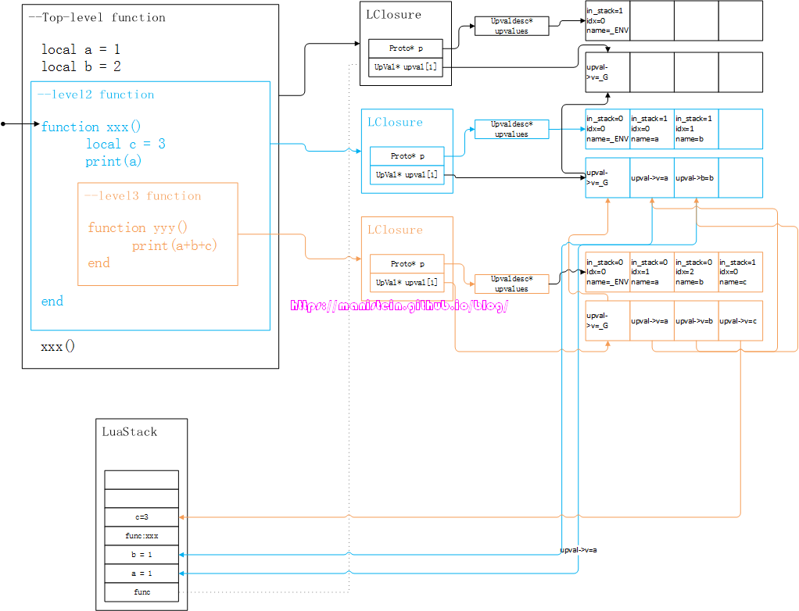
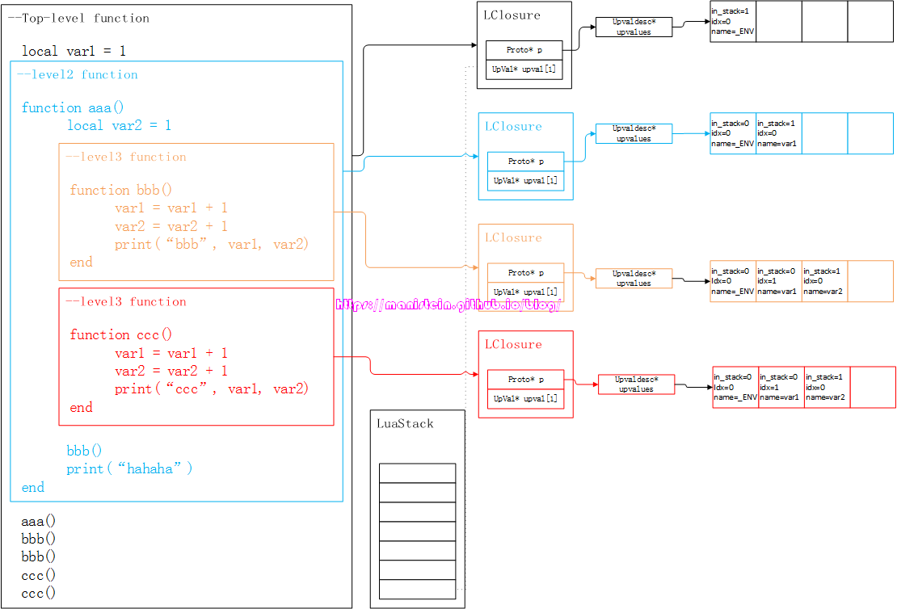
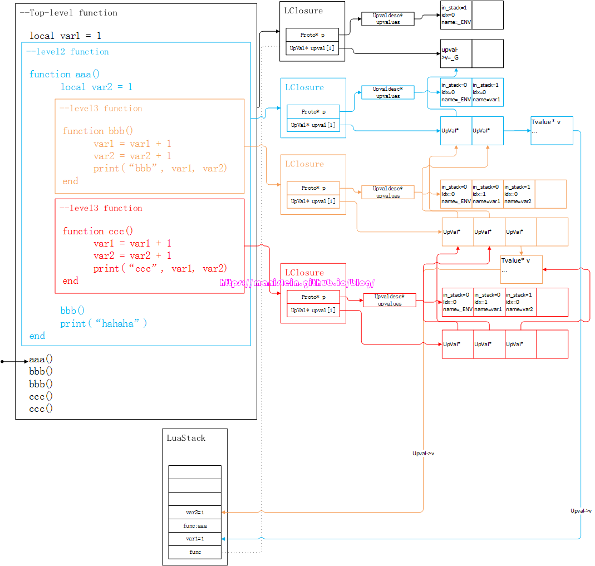
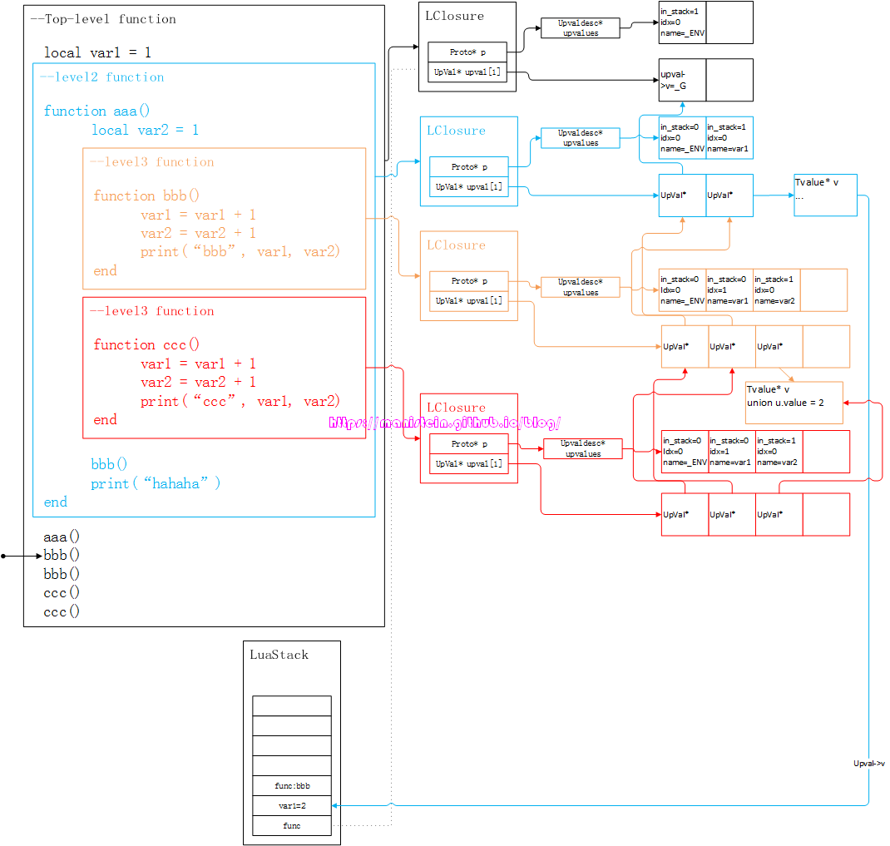
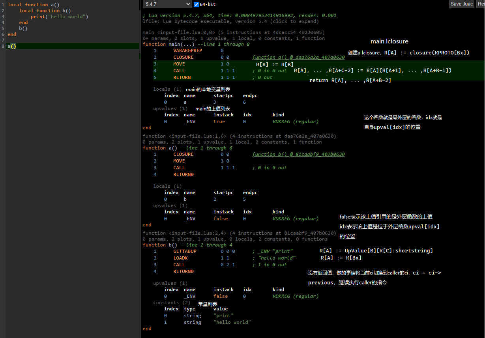

1. 初始化lua状态机
```C
lua_State* lua = luaL_newstate();

// 指向主线程
g->l_registry->array[0] = L
// 全局变量
g->l_registry->array[1] = _G = {}
```

2. 加载并注册Lua的所有标准库到Lua的全局表中
```C
luaL_openlibs(lua);

g->l_registry->array[1] = _G = {
    "_G" = _G,
    "_VERSION" = LUA_VERSION,
    "package" = {...}
    "io" = {...}
    ...
    print = func,
    assert = func,
    ...
    "full user data 的 tname" = 原表{__name=tname}
    ...
}

g->l_registry["_LOADED"] = {
    "_G" = {...},
    "package" = {...}
    "io" = {...}
    ...
}
```

3. 词法语法分析
```C
luaY_parser
```
编译chunk后对应的LClosure在栈中

4. 准备CallInfo
```C
luaD_precall
```

5. 循环执行指令 
```
luaV_execute
```

6. 一些关键解释
- chunk: 它是一段能够被lua解释器编译运行的代码，它可以是一个lua脚本文件，或者是在交互模式中，输入的包含一段代码的字符串。

- ```LClosure```: lua闭包函数，chunk经过词语法分析后，生成这个对象在lua栈中。Proto和upvals组成。把chunk作为一个最顶层lua闭包函数。

- ```LClosure::UpVal```: lua闭包定义，把chunk作为一个最顶层lua闭包函数，该闭包默认带有一个UpValue，这个UpValue的变量名为"_ENV"，它指向Lua虚拟机的全局变量表，即_G表，可以理解为_G表即为当前Lua文件中代码的运行环境(env)。事实上，每一个Lua闭包它们第一个UpValue值都是_ENV。
```C
// 加载Lua代码块但不运行
LUA_API int lua_load (lua_State *L, lua_Reader reader, void *data,
                      const char *chunkname, const char *mode) {
  ZIO z;
  int status;
  lua_lock(L);
  if (!chunkname) chunkname = "?";
  luaZ_init(L, &z, reader, data);
  status = luaD_protectedparser(L, &z, chunkname, mode);
  if (status == LUA_OK) {  /* no errors? */
    LClosure *f = clLvalue(s2v(L->top.p - 1));  /* get new function */
    if (f->nupvalues >= 1) {  /* does it have an upvalue? */
      // env参数不传的话默认就会被设置为_G表
      /* get global table from registry */
      const TValue *gt = getGtable(L);
      /* set global table as 1st upvalue of 'f' (may be LUA_ENV) */
      setobj(L, f->upvals[0]->v.p, gt);
      luaC_barrier(L, f->upvals[0], gt);
    }
  }
  lua_unlock(L);
  return status;
}
```

- ```Proto```: lua函数原型，主要放的就是字节码(指令) 。其中struct Proto **p定义了函数内部定义的函数对应的函数原型。内部的函数在执行指令的时候才会创建LClosure。
  
- ```Proto::Upvaldesc```: 用于描述UpValue并定位到具体某个UpValue的地址，不存储实际的UpValue数值或引用，而是通过一定的方式指向LClosure的upvalues数组。
```
// 函数原型的上值描述
typedef struct Upvaldesc {
  // 上值名称
  TString *name;  /* upvalue name (for debug information) */
  // 本函数的upvalue，是否指向外层函数的栈(不是则指向外层函数的某个upvalue值)
  // 1表示该上值在外层函数的栈上，0表示该上值引⽤的是外层函数的上值
  lu_byte instack;  /* whether it is in stack (register) */
  // 如果instack为1，idx表示该上值是外层函数栈上第idx位置的值
  // 如果instack为0，idx表示该上值是位于外层函数upval[idx]的位置
  lu_byte idx;  /* index of upvalue (in stack or in outer function's list) */
  // 上值类型
  lu_byte kind;  /* kind of corresponding variable */
} Upvaldesc;
```


- ```Open Upvalue```和```Closed Upvalue```: UpVal类型有两种状态：分别是open打开和close关闭状态。一个UpVal当它所属的那个函数返回之后（调用了return），或者Lua运行堆栈发生改变，函数已经不处于合理堆栈下标的时候，该函数所包含的UpVal即会切换到close状态。
  
脚本完成编译时的状态:



执行函数aaa():

**函数bbb和函数ccc的第2个（var2 upvalue）UpVal\* 指针指向了同一个UpVal\* 实例。下图中所示的，包含的值，指向LuaStack中的两个Upvalue，此时是Open Upvalue。**



执行到调用第一个bbb函数的时候:

**在aaa函数执行完毕时，他们的UpVal*实例，会进行close操作，此时是Close Upvalue。**




- ```CallInfo```: lua闭包与lua运行栈的中间桥梁，其中StkIdRel func函数地址指针，指向CallInfo对应的Lua闭包在运行栈中的位置。CallInfo初始化的时候赋值，运行时不变。其中StkIdRel	top指向插入数据后会到达的最高的Lua运行栈的位置，CallInfo初始化的时候赋值，运行时不变。其中struct CallInfo *previous, *next调用链。其中const Instruction *savedpc用于记录当前虚拟机执行器执行到当前函数的哪条指令。

- 指令介绍:
```C
/*===========================================================================
  We assume that instructions are unsigned 32-bit integers.
  All instructions have an opcode in the first 7 bits.
  Instructions can have the following formats:

        3 3 2 2 2 2 2 2 2 2 2 2 1 1 1 1 1 1 1 1 1 1 0 0 0 0 0 0 0 0 0 0
        1 0 9 8 7 6 5 4 3 2 1 0 9 8 7 6 5 4 3 2 1 0 9 8 7 6 5 4 3 2 1 0
iABC          C(8)     |      B(8)     |k|     A(8)      |   Op(7)     |
iABx                Bx(17)               |     A(8)      |   Op(7)     |
iAsBx              sBx (signed)(17)      |     A(8)      |   Op(7)     |
iAx                           Ax(25)                     |   Op(7)     |
isJ                           sJ (signed)(25)            |   Op(7)     |

  A signed argument is represented in excess K: the represented value is
  the written unsigned value minus K, where K is half the maximum for the
  corresponding unsigned argument.
===========================================================================*/


// 指令模式
// iABC参数上限：4个，8位的A（2的8次方即最多能存储256个数），8位的B，8位的C，1位（2的1次方即最多能存储2个数）的k
// iABC是最常用的指令模式
// 
// iABx参数上限：2个，8位的A，17位无符号的Bx（Bx，2的17次方即最多能存储131072个数）
// 
// iAsBx参数上限：2个，8位的A，17位有符号的Bx（sBx，2的17次方即最多能存储131072个数）
// 
// iAx参数上限：1个，25位无符号的Ax（Ax，2的25次方即最多能存储33554432个数）
// 
// isJ参数上限：1个，25位有符号的sJ（sJ，2的25次方即最多能存储33554432个数）
// 目前，唯一使用该指令模式的只有跳转指令OP_JMP；所以该指令模式名字'isJ'及参数'sJ'都带有字母‘J’(Jump，跳转)，
// 就是为了更加直观地知道这个指令模式对应的是跳转功能
enum OpMode {iABC, iABx, iAsBx, iAx, isJ};  /* basic instruction formats */
```

7. overview.lua指令
   

