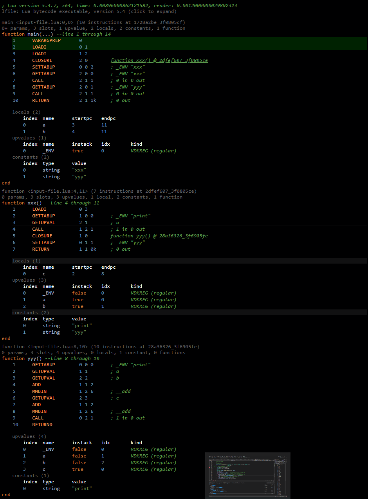

1. upvalue.lua对应的字节码

```LUA
local a = 1
local b = 2

function xxx()
	local c = 3
    print(a)

    function yyy()
    	print(a+b+c)
    end
end

xxx()
yyy()
```



2. open上值关键流程, 词语法编译的时候, 已经知道每个LClosure用有p->sizeupvalues个上值及其相关信息描述p->upvalues, 当前状态机L->openupval记录了所有open上值，
将会在这里查找本函数要用到的open上值, 如果找不到就新建，并且加入到L->openupval链表中。open上值都是共享。这里还有意思的一点是，具有open upvalue的状态机链表，
只要当线程L第一次创建open上值时, 它需要被添加到G(L)->twups指向的链表中, 从而构成了链表, G->twups => LN->twups => LN-1->twups => ... L1-> twups => NULL
```C
    vmcase(OP_CLOSURE) {
        StkId ra = RA(i);
        Proto *p = cl->p->p[GETARG_Bx(i)];
        halfProtect(pushclosure(L, p, cl->upvals, base, ra));
        checkGC(L, ra + 1);
        vmbreak;
    }
```
```C
// 创建Lua闭包
static void pushclosure (lua_State *L, Proto *p, UpVal **encup, StkId base,
                         StkId ra) {
    // 词语法编译好的结果，上值的个数
    int nup = p->sizeupvalues;
    Upvaldesc *uv = p->upvalues;
    int i;
    LClosure *ncl = luaF_newLclosure(L, nup);
    ncl->p = p;
    setclLvalue2s(L, ra, ncl);  /* anchor new closure in stack */
    for (i = 0; i < nup; i++) {  /* fill in its upvalues */
        if (uv[i].instack)  /* upvalue refers to local variable? */
            ncl->upvals[i] = luaF_findupval(L, base + uv[i].idx);
        else  /* get upvalue from enclosing function */
            ncl->upvals[i] = encup[uv[i].idx];
        luaC_objbarrier(L, ncl, ncl->upvals[i]);
    }
}
```
```C
// 查找open upvalue，level是栈中的位置
UpVal *luaF_findupval (lua_State *L, StkId level) {
    UpVal **pp = &L->openupval;
    UpVal *p;
    lua_assert(isintwups(L) || L->openupval == NULL);
    // 遍历链表尝试查找level对应的上值UpVal
    while ((p = *pp) != NULL && uplevel(p) >= level) {  /* search for it */
        lua_assert(!isdead(G(L), p));
        if (uplevel(p) == level)  /* corresponding upvalue? */
            return p;  /* return it */
        pp = &p->u.open.next;
    }
    /* not found: create a new upvalue after 'pp' */
    // 找不到就创建新的open upvalue
    return newupval(L, level, pp);
}
```
```C
// 创建一个新的open upvalue
static UpVal *newupval (lua_State *L, StkId level, UpVal **prev) {
    GCObject *o = luaC_newobj(L, LUA_VUPVAL, sizeof(UpVal));
    UpVal *uv = gco2upv(o);
    UpVal *next = *prev;
    uv->v.p = s2v(level);  /* current value lives in the stack */
    // 放到prev的后面
    uv->u.open.next = next;  /* link it to list of open upvalues */
    uv->u.open.previous = prev;
    if (next)
        next->u.open.previous = &uv->u.open.next;
    *prev = uv;
    if (!isintwups(L)) {  /* thread not in list of threads with upvalues? */
        // 没有初始化，就链起来吧
        L->twups = G(L)->twups;  /* link it to the list */
        G(L)->twups = L;
    }
    return uv;
}
```

3. closed上值关键流程，对应代码中xxx()执行完毕的时候，对应xxx函数栈帧要清除了，对应的open上值要转换到cloed上值，并且脱离L->openupval，并且这个节点uv->u.value承接这个上值内容，
并且uv->v.p = slot
```C
vmcase(OP_RETURN) {
    StkId ra = RA(i);
    int n = GETARG_B(i) - 1;  /* number of results */
    int nparams1 = GETARG_C(i);
    if (n < 0)  /* not fixed? */
        n = cast_int(L->top.p - ra);  /* get what is available */
    savepc(ci);
    if (TESTARG_k(i)) {  /* may there be open upvalues? */
        ci->u2.nres = n;  /* save number of returns */
        if (L->top.p < ci->top.p)
        L->top.p = ci->top.p;
        luaF_close(L, base, CLOSEKTOP, 1);
        updatetrap(ci);
        updatestack(ci);
    }
    if (nparams1)  /* vararg function? */
        ci->func.p -= ci->u.l.nextraargs + nparams1;
    L->top.p = ra + n;  /* set call for 'luaD_poscall' */
    luaD_poscall(L, ci, n);
    updatetrap(ci);  /* 'luaD_poscall' can change hooks */
    goto ret;
}
```
```C
// 函数要结束了，处理open upvalue和 to-be-closed变量
StkId luaF_close (lua_State *L, StkId level, int status, int yy) {
    ptrdiff_t levelrel = savestack(L, level);
    luaF_closeupval(L, level);  /* first, close the upvalues */
    while (L->tbclist.p >= level) {  /* traverse tbc's down to that level */
        StkId tbc = L->tbclist.p;  /* get variable index */
        poptbclist(L);  /* remove it from list */
        prepcallclosemth(L, tbc, status, yy);  /* close variable */
        level = restorestack(L, levelrel);
    }
    return level;
}
```
```C
// 函数要结束了，处理open upvalue
void luaF_closeupval (lua_State *L, StkId level) {
    UpVal *uv;
    StkId upl;  /* stack index pointed by 'uv' */
    // 高于level都需要closed upvalue
    while ((uv = L->openupval) != NULL && (upl = uplevel(uv)) >= level) {
        // 这个位置放入要清除的值
        TValue *slot = &uv->u.value;  /* new position for value */
        lua_assert(uplevel(uv) < L->top.p);
        // 把当前UpVal从链表移除
        luaF_unlinkupval(uv);  /* remove upvalue from 'openupval' list */
        setobj(L, slot, uv->v.p);  /* move value to upvalue slot */
        uv->v.p = slot;  /* now current value lives here */
        if (!iswhite(uv)) {  /* neither white nor dead? */
            nw2black(uv);  /* closed upvalues cannot be gray */
            luaC_barrier(L, uv, slot);
        }
    }
}
```